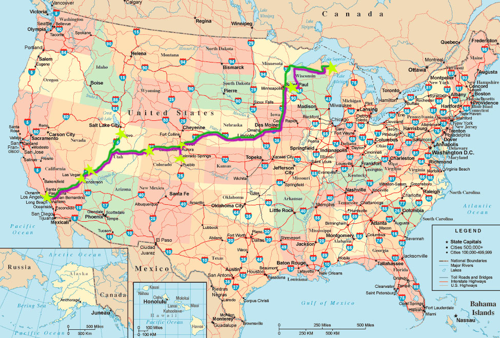

It’s true, we traveled to Los Angeles and back, 5,200 miles in 10 days. We made quite a few nice stops along the way, too. Our first leg was the longest, going from Marquette to Grand Junction, CO, nonstop. There we stopped at Ridgeline Fitness with Adam Ford for a quick training session before getting back on the road in attempt to make it to Provo, UT for an afternoon training session. We made it there and had an exceptional time lifting with David Chiu for the afternoon. We got back on the road aimed for Los Angeles, but 40 straight hours driving caught up to us and we got a cheap hotel shortly after getting into Nevada (we got to spend about 6 hours in it). The next day we completed the journey to the West Coast and stopped at the Chikara Weightlifting Club to squat in celebration. Chris Kimura was kind enough to keep it open for us even after his athletes had left. Afterwards we finally got to our hotel; it felt so good to finally relax! The next day was the whole reason for the trip: My treatment at D.I.S.C. Sports and Spine Center. The morning began early and kept going till late afternoon, but all went well. The people at D.I.S.C. are incredible, I don’t know what I would have done without them this past year. Their generosity and expertise have allowed me to continue training. A special thanks to everyone there!

<figure>
    
    <figcaption><a href="../images/la_road_trip.jpg" title="map of our trip">
    Map of our 10 day road trip, significant stops marked by stars.</a></figcaption>
</figure>

Thursday morning we were on the road again, sites set on Las Vegas. We stepped out of the car at Average Broz’s Gymnasium and were amazed at how hot it was. I didn’t know that kind of heat was possible, it just doesn’t happen in Marquette (which is north of 90% of the Canadian population). We were treated to quite a show there, watching Pat Mendes lift well over the Junior American Records. After John Broz taught us some lessons about playing glow-in-the-dark mini golf we were off to Colorado Springs to crash Krych’s house and train at the Olympic Training Center for a few days. It was all we’d hoped it would be. We would love to be back sometime not having been in a van the whole week prior, but an incredible experience as always.

The last night of our quest was spent at the lovely Allie Henry’s house in River Falls, WI. We also got a training session in at River Falls Fitness Center. The next morning we took on the last leg of our journey back to Marquette, getting back just in time to step out of the van and into the gym, once more.

We want to extend huge thank you’s to everyone who gave us a place to train, a place to sleep, food to eat, and all the other things we just couldn’t have done without. A special thanks to Mama Jarv for letting us drive her van over 5,000 miles. We could not have been more blessed and trips like this make me realize how awesome the weightlifting world is. Thank you all!
