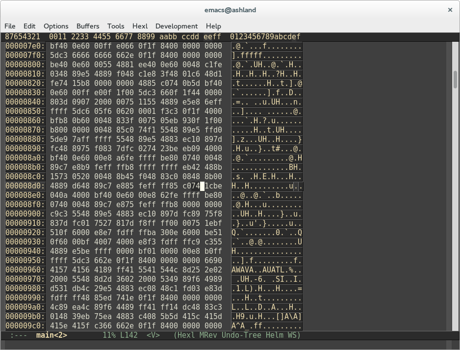

### Intro
The constant back-and-forth between hacking and prevention requires each side of
the game to continually innovate, and the progressions are really very
fascinating. It's a *hugely* broad field with countless vectors to consider,
and here I'll execute just one proof of concept: a software attack on an
"authenticated" hello world binary.

### Making the Program
Step 1 is to actually get a program to crack. In this experiment, I'll use a
program that expects a password. If the password is not provided it exits with
an error, if the password is wrong no action is taken, and if the password is
correct it prints the string "Access granted: Hello World!".

This source is on [Github](https://github.com/stevejarvis/apphack), otherwise
copy the following makefile and source to play along.

#### makefile

CC=/usr/bin/g++
OPTS=-g

all: main.cc makefile
    $(CC) main.cc $(OPTS) -o main

clean:
    rm *.o main


#### main.cc

#include <iostream>
#include <string.h>

using std::cout;
using std::endl;

const char * secret = "please";

int main( int argc, char **argv )
{
    if( argc != 2 ) {
        cout << "usage: ./main <password>" << endl;
        return -1;
    }

    if( 0 == strcmp( argv[1], secret ) ) {
        cout << "Access granted: Hello World!" << endl;
    }

    return 0;
}


To get started, run make from the directory in which the makefile and source
exist. This shouldn't require anything more than GCC and make.


$ ls
main.cc makefile
$ make


Run the application a few times, notice that it does actually work, and only
prints "Access granted: Hello World!" when the password is "please".


$ ./main please
Access granted: Hello World!
$ ./main somethingelse


### Examining the Assembly
Beauty, now we have a compiled binary. In real life, if we were going to look
for vulnerable places in an application, it'd be hugely helpful to examine the
source code used to create it, but that's not always provided. It's crucial to
realize, though, that even the binary is human readable with help from tools
like objdump, albeit less friendly on the eyes than C. Now, use objdump to
see what the compiled application looks like.


$ objdump -d main
[...]
0000000000400886 <main>:
400886: 55                     push   %rbp
400887: 48 89 e5               mov    %rsp,%rbp
40088a: 48 83 ec 10            sub    $0x10,%rsp
40088e: 89 7d fc               mov    %edi,-0x4(%rbp)
400891: 48 89 75 f0            mov    %rsi,-0x10(%rbp)
400895: 83 7d fc 02            cmpl   $0x2,-0x4(%rbp)
400899: 74 23                  je     4008be <main+0x38>
40089b: be eb 09 40 00         mov    $0x4009eb,%esi
4008a0: bf 40 0e 60 00         mov    $0x600e40,%edi
4008a5: e8 a6 fe ff ff         callq  400750 <_ZStlsISt11char_traitsIcEERSt13basic_ostreamIcT_ES5_PKc@plt>
4008aa: be 80 07 40 00         mov    $0x400780,%esi
4008af: 48 89 c7               mov    %rax,%rdi
4008b2: e8 b9 fe ff ff         callq  400770 <_ZNSolsEPFRSoS_E@plt>
4008b7: b8 ff ff ff ff         mov    $0xffffffff,%eax
4008bc: eb 42                  jmp    400900 <main+0x7a>
4008be: 48 8b 15 73 05 20 00   mov    0x200573(%rip),%rdx        # 600e38 <secret>
4008c5: 48 8b 45 f0            mov    -0x10(%rbp),%rax
4008c9: 48 83 c0 08            add    $0x8,%rax
4008cd: 48 8b 00               mov    (%rax),%rax
4008d0: 48 89 d6               mov    %rdx,%rsi
4008d3: 48 89 c7               mov    %rax,%rdi
4008d6: e8 85 fe ff ff         callq  400760 <strcmp@plt>
4008db: 85 c0                  test   %eax,%eax
4008dd: 75 1c                  jne    4008fb <main+0x75>
4008df: be 04 0a 40 00         mov    $0x400a04,%esi
4008e4: bf 40 0e 60 00         mov    $0x600e40,%edi
4008e9: e8 62 fe ff ff         callq  400750 <_ZStlsISt11char_traitsIcEERSt13basic_ostreamIcT_ES5_PKc@plt>
4008ee: be 80 07 40 00         mov    $0x400780,%esi
4008f3: 48 89 c7               mov    %rax,%rdi
4008f6: e8 75 fe ff ff         callq  400770 <_ZNSolsEPFRSoS_E@plt>
4008fb: b8 00 00 00 00         mov    $0x0,%eax
400900: c9                     leaveq
400901: c3                     retq
[...]


The output isn't easy for anyone to read, but looking for expected markers will
make it much simpler. To start, look for "main" (the only output I've included
above). That's the assembly code generated for the main function of our
application. Looking through main, there's one instruction that sticks out:

4008d6: e8 85 fe ff ff        callq  400760 <strcmp@plt>

The strcmp operation is the comparison done between the secret password and the
provided guess. If that wasn't obvious, the move operation on something named
"secret" 6 instructions earlier is a good clue.

### Hacking the Assembly
Now imagine that you were handed this compiled program with no knowledge or way
to learn the secret password, and your task is to get the secret message to
print. How would you do it? It'd be nice for the attacker if the application
didn't accept one secret password, but instead accepted any nonsense given as
proper authentication. Above, we already found what's likely the password check
(strcmp). The jump not equals (jne) instruction following close behind is surely
the action taken based on the result of the check.

So, the properly working application jumps when the provided string is not equal
to the secret password. It'd be really nice if the program instead did the exact
same jump for <i>any</i> provided string. Based on our research so far, it's
a great presumption that changing that instruction from [jump not equals
(jne, opcode 75) to jump equals (je, opcode 74)](http://unixwiz.net/techtips/x86-jumps.html)
will do exactly that (really, that will cause the program to jump on any string
that isn't the password, but it's a fair assumption that I, the attacker, won't
randomly choose the actual password!).

To make this edit, I'll use emacs' built-in hex editor. Use hexl-find-file to
open main in hex mode, then search for the assembly to edit. Thankfully, the
surrounding opcodes "75 1c" make the location unique and easy to find.


$ emacs
M-x hexl-find-file


Change the opcode 75 to a 74 and save.
<figure>
    
    <figcaption>Screenshot of the emacs hexl editor.</figcaption>
</figure>

Now, rerun the application and see that any nonsense passes as authentication;
the program passes out "Hellos" to anyone and everyone! You can also see exactly
what has changed by running objdump again.


$ ./main please
$ ./main somethingelse
Access granted: Hello World!


### That's Bad! How to Prevent
A common prevention is to use hashes to ensure that the binary being run is just
as the author intended. For example, if I were distributing this binary as a
piece of software, I could include along with it the SHA1 hash
"322a9d4f1186fab62fce0145c18e62c35533669c". Each time someone obtains a copy, he
or she would derive the hash independently and check that it matches. If not,
there's a problem! Notice that changing just the single instruction of the
binary effects the SHA1 hash in a very noticeable way.

#### Before the assembly edit:

$ cat main | openssl sha1
(stdin)= 322a9d4f1186fab62fce0145c18e62c35533669c


#### After the assembly edit:

$ cat main | openssl sha1
(stdin)= 6b0a47f55812e016f0d12c5182cdb3f43c0ca091


Many large, professional applications achieve the same safety with [code signing
certificates.](http://msdn.microsoft.com/en-us/library/ie/ms537361%28v=vs.85%29.aspx)
It's slightly more complex and includes a verification of the
author's identity, but the general idea is the same.

### Closing Note
Given the general abuse of the word "hack" I feel obligated to mention that
not all hacking is done in the form of attacking, or even in the realm of
security at all. Despite my use here, I generally refer to [Stallman's
distinction between "cracking" and "hacking".](https://www.stallman.org/articles/on-hacking.html)

This experiment was built and executed on Arch Linux with GCC 4.9 (Prerelease)
and Emacs 24.3.1.
