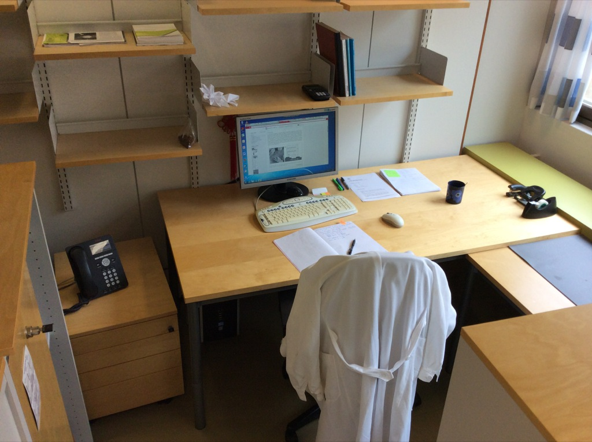

Today was a big small day in the lab. Here's what happened:

* I got 10 freshly homemade glassy carbon electrodes. (I hope you're excited - this is a big deal!!)
* I got a brand spankin' new lab notebook.
* I got my username and password for the system at work so I can use the computer to look up articles, again. And although my browser was set to Chinese, I figured out how to browse in a language I understand.
* I got a new Sharpie and a fancy pen specifically for signing documents.

<figure>
    
    <figcaption> This is my new office - nice big windows with a lot of shelves and storage. Do I look kind of important? :) </figcaption>
</figure>
