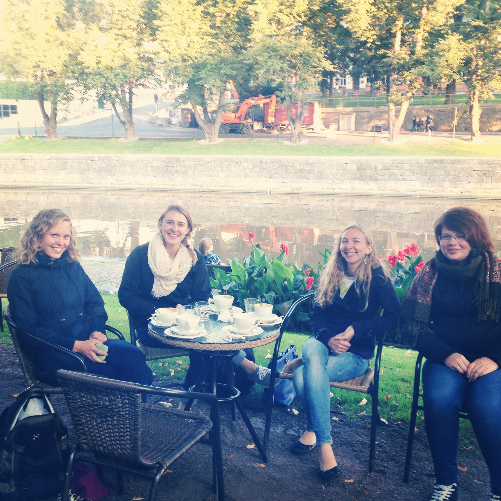

Sorry I've been away for so long - I'm back with a quick update.

What's been going on? I've been researching, meeting friends, making plans, drinking coffee, busting PRs, and learning Swedish.

### Research
My advisors in Memphis shipped me a chemical that I needed for my experiments and, after a slight hangup at customs, I got the package in my hands and now, there's no stopping me!!

### Meeting friends
I've made a few friends through both church and work. A quick rundown of church friends includes a fun group of girls from Lithuania, Finland, and the US. One is finishing up her certification as a sea kayaker so pending her schedule next week, she's taking me out for a trip! We are in crunch time before the water gets too cold!

Work friends include some fun people from Finland, Ecuador, Russia, Peru, Japan, and China. It's a lot of fun to hear about traditions in all these countries. We are currently planning a hot pot night that will feature some tasty dishes from China and Japan. My friend from China makes a lot of different types of herbal tea that the Chinese use for balancing our body's energy. The most recent tea included chrysanthemum and a nut from the Taiwan sweet gum tree. When placed in water, the nut expands from the size of an almond to a small-sized jellyfish. So, our lab calls it a jellyfish. When pouring some tea in her mug, one coworker shrieked and said "Ahh I got jellyfish legs in my mug!". The story may not transfer as funny but trust me, it was hilarious.

### Making plans
With new friends come new plans. In the making, we have coffee dates on the river, sightseeing (a trip to the coast, Turku castle), hockey games, a cruise to Stockholm, and even more fun!

### Drinking coffee
We drink a lot of coffee.

<figure>
    
    <figcaption> Relaxing by the river outside of Cafe Art with some coffee and treats </figcaption>
</figure>

### Busting PRs
Gym time is still important to me - even in Finland. If you know me, you know my motto "Every day is leg day". Last week, I hit a back squat PR (220 x 5 and 231 x 2). Today, I was feeling good when I got in the gym and loosened up so I had an unplanned max out day - hit 225.5 x 5 and 231 x 3. Felt really good! If you see Allie Henry, let her know I'm coming for her.

### Learning Swedish
I am enrolled in a Beginner's Swedish course that meets twice a week for 2 hours each session. On the first day of class, the teacher just threw us into conversation - asked us questions in Swedish and waited for an answer. I thought he was crazy. Turns out, he knows what he's doing. I am surprised with how much Swedish I already know after only 4 classes and am really looking forward to learning the language!
