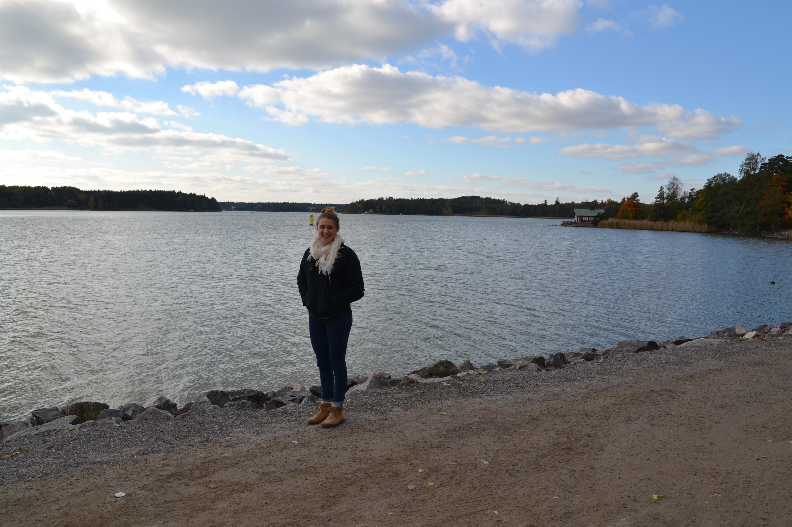
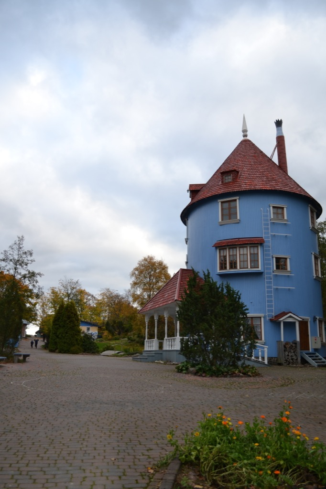

How did I get so lucky to fall into a lab with such kind and fun people?! Last Sunday, Ulriika took me to all her favorite spots in and around Turku. Ulriika is originally from Turku so she makes for an excellent tour guide! Around 1:30 pm, we hopped in the car and were off!

The first stop was of a public sauna on a lake. The beach front is a popular place in the summer since the city only has a few nice beaches. Even when we were there last week, a couple people swimming! The sauna is open year-round and is a popular spot in the winter for some ice swimming. I think I'm going to have to try it before I leave. Do as the Finns do, right?

Next, we went to an old dance hall that was a popular spot for people to go get their groove on. It is mostly popular with the older generations and then the up and coming generations. It sounds like my generation took a break and wasn't so interested in learning how to dance. Behind the dance hall, there is deck overlooking one part of the glorious Baltic. There is, of course, another island in clear view right across the channel. The fall colors filled the island which made for an incredible view.

We drove past the castle - it looks even more incredible in person. I still have to go there for an official tour. The next stop was Ruissalo where we hiked through the woods right along the coast. The path follows a short part of the cruise from Turku to Stockholm so maybe I'll recognize the scenery when I take the cruise at the end of the month. We moved to another area of Ruissalo on yet another coastline and had sandwiches and coffee while watching some brave souls windsurf on the sea.

<figure>
     
    <figcaption> Our first and second stops in Ruissalo - the second is where we stopped for lunch. </figcaption>
</figure>

We finished our venture with a drive to Naantali where we visited Moomin park. Moomin is a comic started in Finland. The comic turned into a cartoon series and a movie just came out, as well. The amusement park wasn't open for business but the gates were open so we could still walk through and look around. It is beautiful - not what I would usually consider an amusement park. It contains many colorful buildings that resemble those in the comics but a large part of encompasses the natural landscape. The trails go through the woods and make it feel like a true adventure. I think the place is just as fun for adults as it is for the kiddos.

<figure>
    
    <figcaption> The Moomin house at the park. It's large because the Moomins like having guests :) </figcaption>
</figure>

By the time we got back to the car, our faces were a little cold from the wind so it felt nice to turn the heat on. Overall, it was definitely a successful day and it was so nice to get more familiar with the beautiful country I'm living in.

Jag älskar Åbo! 
