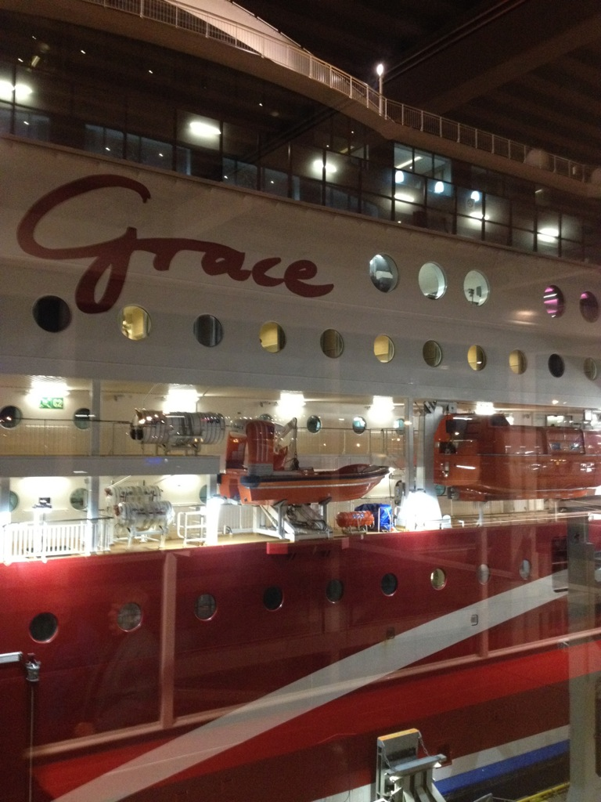
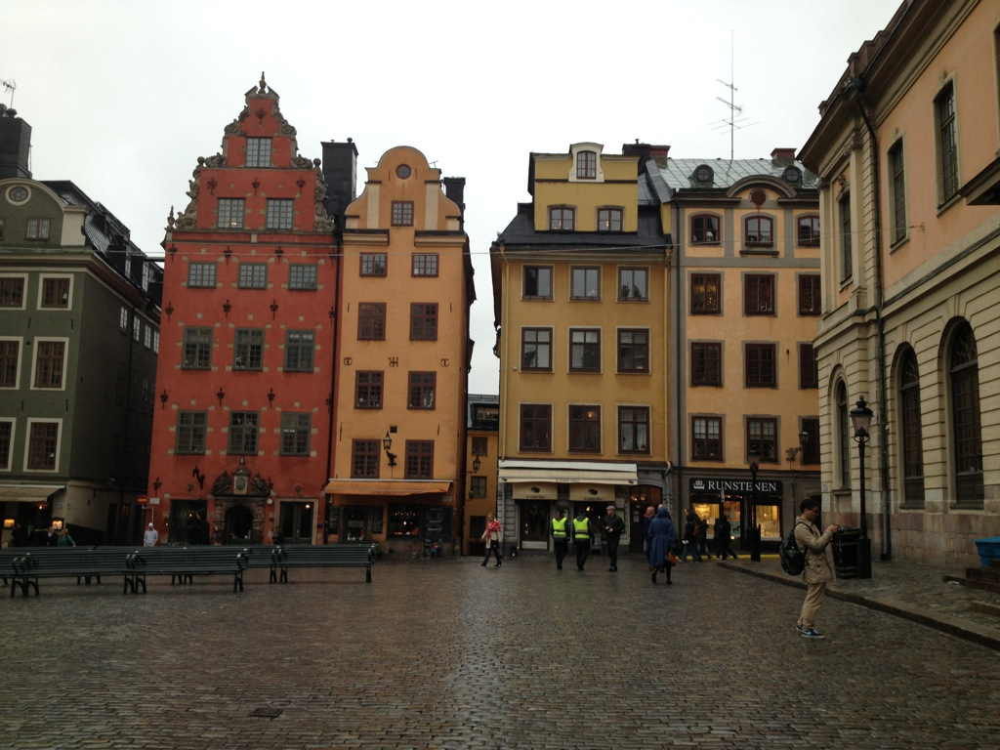
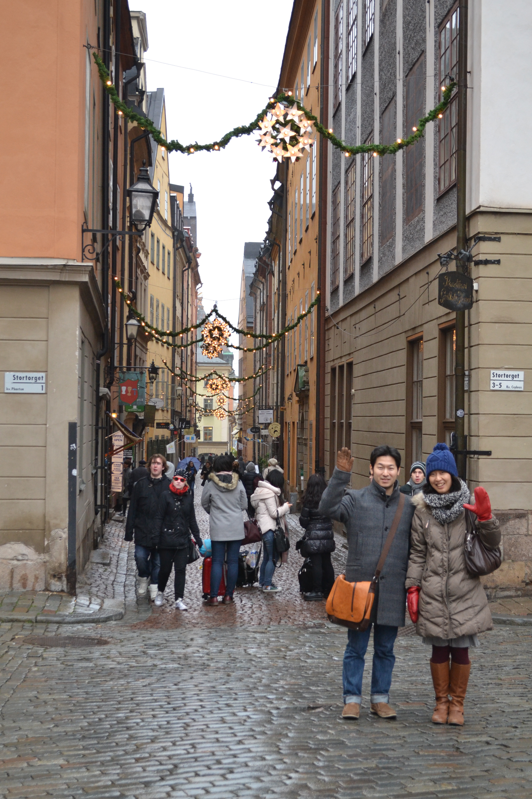
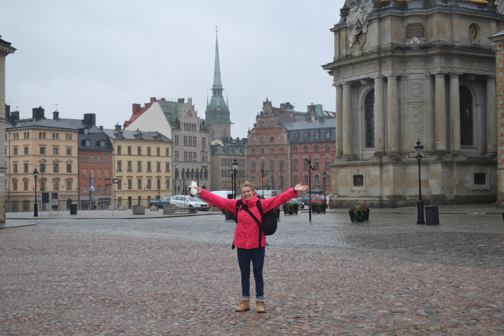
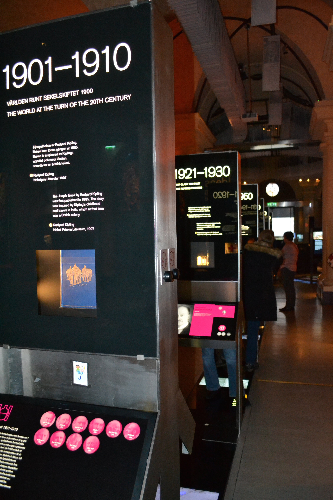
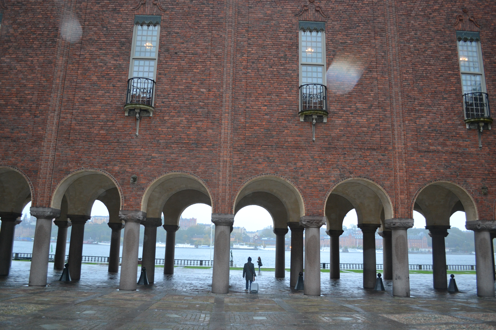
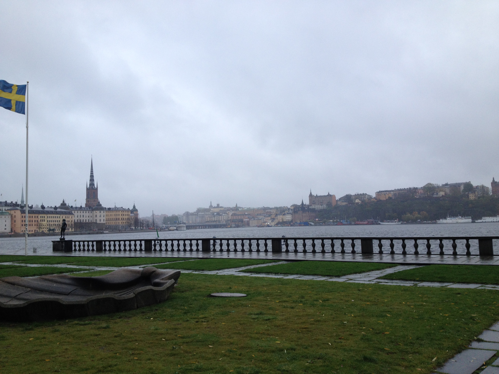
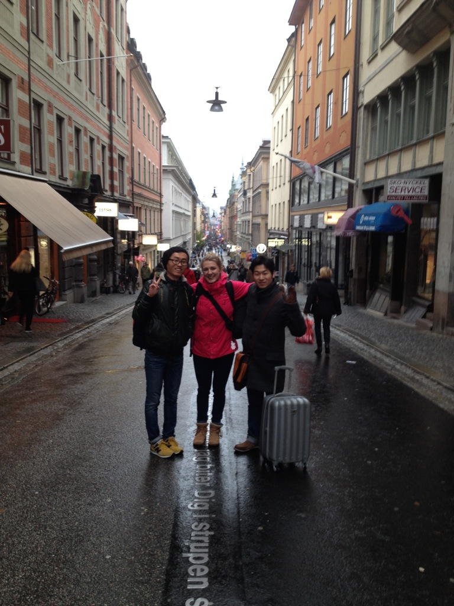
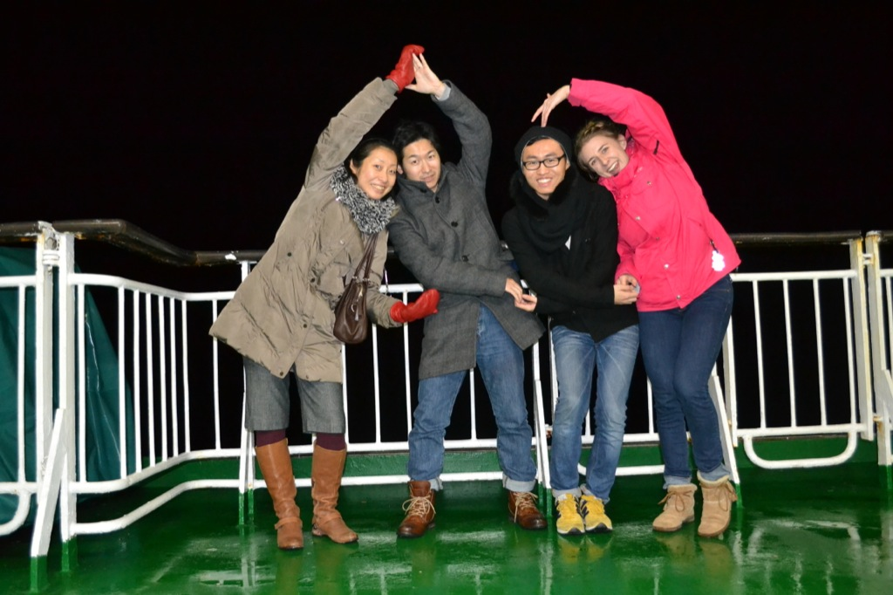

On Thursday night I boarded the beautiful ship with three great friends, the crew yelled "Ahoy!", and we were off! Okay, no one yelled Ahoy but the rest really happened. We began our 10 hour cruise on Grace with a short tour of just a few of the 10 floors.

<figure>
    
    <figcaption> Our beautiful ship, Grace. Including bars, restaurants, karaoke, dancing, gambling, shopping, and so much more. </figcaption>
</figure>

We found the tax-free shop and managed to find a few things that we absolutely needed (drinks and snacks) then landed on a bar/club. We saw a crowd of people gathering at the stage where the curtains were still closed. We decided that we couldn't leave without finding out what all the hype was about so we joined the crowd near the stage. After about 15 mintues, the curtain opened and the multigenerational crowd began cheering as a Finnish rapper ran out on to the stage with ELASTINEN flashing on the screen backdrop. He was pumping up the crowd and although we couldn't understand anything he said, we were getting excited, too! His songs were fun and energetic and we got pretty into it...raising the roof, you might say. Turns out, Elastinen is one of the most famous rappers in Finland! And we were right there up close with him.

Friday morning, we were up bright and early to unboard...deboard?...from the ship and enter the beautiful rainy city of Stockholm. It was still dark outside but we began walking towards the city center on a mission to find some coffee. We had some difficulty finding a cafe open at such an early hour so we began our trip with breakfast at McDonalds...at least they had free WiFi? Semi-satisfied from breakfast, we headed towards Old Town (Gamla Stan) prepared for a day of sightseeing.

<figure>
    
	   <figcaption> The beautiful, colorful houses, streets and lights of Old Town. </figcaption>
</figure>

My first impression of Old Town is that it was absolutely beautiful. Every single street was made of beautiful cobblestone and the houses were tall and painted beautiful colors of orange, pink, red, and yellow. We walked along the sea for a while then cut through a cozy alley to walk by the cute shops lining the street. We took a tour of the palace, saw the changing of the guards, snapped some pictures with the guards, as well. The guard we had a photoshoot with was surprisingly nice and talkative. I guess not all palace guards are sworn to silence and stillness.

<figure>
    
    <figcaption> Loving the beautiful city of Stockholm. </figcaption>
</figure>

We also toured an absolutely incredible cathedral and the nobel prize museum. It was great to go to the museum with friends that also love science! We found a pub for lunch where we warmed up with a cup of coffee then enjoyed a tasty dish of Swedish meatballs and mashed potatoes. It was amazing! Our waiter didn't appear to have an accent when he spoke English so I asked him where he was from...Seattle! Americans unite!

<figure>
    
    <figcaption> Amazing to see all the brilliant minds that were awarded the Nobel Prize. </figcaption>
</figure>

We continued walking the streets towards City Hall where we shivered while capturing the beautiful view near the water.

<figure>
    
	
    <figcaption> Inside the courtyard of City Hall looking towards the water and after walking under the arches, we saw the gorgeous open view. </figcaption>
</figure>

On Saturday, we spent the day shopping and visited both departments and small souvenir shops. Of course, we managed to find a few nice cafes, as well. I got the chance to speak Swedish with our taxi driver! Looks like my beginner's course is paying off! 

<figure>
    
    <figcaption> The main shopping street in Stockholm called Drottninggatan, which means "Queen Street". </figcaption>
</figure>

When we got on the ship, Amorella, for our cruise back to Turku and had planned on a quick trip to the tax-free shop for some goods followed by dinner and bed. We were very tired from walking around all weekend. But when we got on the ship and got some food in us, we got a boost of energy and headed to a concert. The music was a mix of upbeat tunes that were perfect for dancing. We hit the dance floor but were obviously the odd men out in the sea of couples perfectly in step with one another. Somehow, we found ourselves in the middle of the best dancers in the Nordic countries. It was so much fun to watch them all dance, though, and we were all very impressed (and jealous!).

We finished off the night with a trip to the deck to feel the breeze and see the waves. Since it was just about one o'clock in the morning, we couldn't see much but every now and then we'd spy a buoy or small island. We took the opportunity to share stories, laugh, sing, and have a photo shoot. It was definitely a trip to remember!

<figure>
    
    <figcaption> The amazing friends I traveled with! I'd like you to meet (right to left) Ning, Yasuhito, and his wife, Junko. </figcaption>
</figure>

Jag älskar Stockholm!
