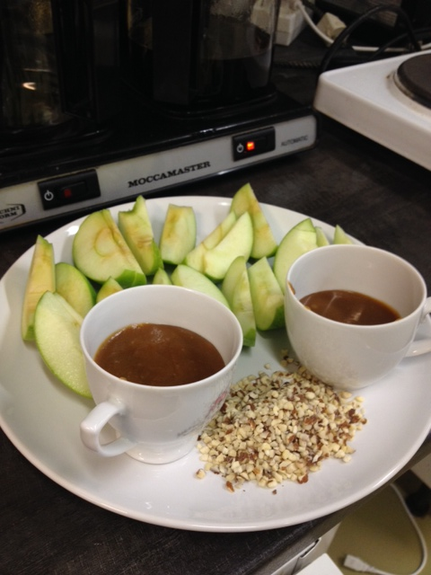
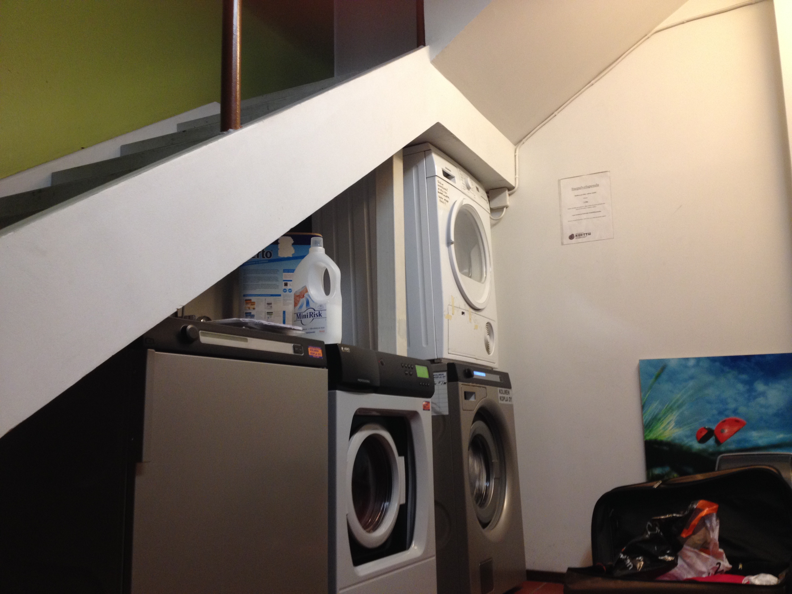

I only have a short 6.5 weeks remaining here in Turku. The days are getting short (by 5 o'clock it's already quite dark) but I'm set on making the most of them.

 What happened this week? A little bit of this, a little bit of that. 

**The Good**
------------

I wanted to make a nice treat for my friends and coworkers and discoverd that they haden't experienced the deliciousness that is caramel apples. I set out to the grocery store and after bothering just 3 different people for help, I managed to find the necessary ingredients. Luckily, it was a short list. It was my first time making caramel sauce so unfortunately I didn't nail it. The sauce came out a little too thin so simply dipping the whole apple in the sauce only led to a pile of caramel sauce on the plate and a bare apple. I changed plans and sliced apples leaving caramel in a small dish for dipping and a pile of crushed almonds as an option to cover the caramel. I am so happy that they enjoyed the treat despite it not being prepared/presented in the traditional way.

<figure>
    
    <figcaption> Not your average caramel apple but turned out pretty darn fine. </figcaption>
</figure>

A funny story:  My friend, Yasuhito (he was one of the few I traveled with to Stockholm), wanted me to try Salmiakki. It's a Finnish candy that the Finns are absolutely obsessed with. It's sort of a salty black licorice. So, Yasuhito brought a can into work that said "Salmiakki" on the label. He had trouble opening it so asked my ofice mate, Kim, for help. After some struggle, Kim finally got it opened and immediately closed the lid. He said, "Yasu...this is not Salmiakki". We both looked curiously at Kim, waiting for him to tell us what was in the can. "It's Salmiakki-flavored tobacco". Sure enough! We looked inside the "tin" to find packets of tobacco or "snus". Upon further inspection, we saw that it was actually a healthy version and tobacco-free. They were actually to imitate the feeling of tobacco to help people kick their habit. So, since it was tobacco-free...we tried it! It's such a popular thing in Finland and Sweden and when in Finland...so there we were in the coffee room, with snus under our lip.

 My friend informed me that when the negotiations were underway for Sweden to joint he European Union, Sweden said they wouldn't join unless they could still have tobacco. It's illegal to sell/buy snus in any part of the EU but since they wanted Sweden to join, they allowed them to continue purchasing snus. So Finns often buy in bulk if they ever go to the ship (the cruise I took from Turku to Stockholm) or find a friend that will sell to them. I think that says how important this snus is to the Sweds and Finns.  

**The Bad**
-----------

It seemed to be a series of unfortunate events this week that included smooshed butter in my gym bag and spilled wet coffee grounds all over the kitchen floor. Oh, and a strange man may have chased me down on my bike and spanked me at 10 in the morning. Luckily, that isn't a normal thing here but it was not a pleasant way to start my day. I promise that Finns are usually quite pleasant (and quiet). And now I know how to say "harassed" in Swedish. Just expanding my vocabulary, right?!

**More Good**
-------------

There have been letters from home, Bailey's in my Saturday morning coffee, and concerts. Last night, I went to a classical concert with Ulriika. This is the second one that I've attended. The first was a very large symphony and this one was a student orchestra but both were quite enjoyable. Ulriika has friends in both of them so it's nice to have a tie to the talented musicians. This concert was at the music school which is a former rope factory. They kept a lot of the old architecture so inside the building, you can see the original brick walls, steel stairs and poles. It's very charming. After the concert, we enjoyed a beer at a pharmacy-turned-pub. The city of Turku has a few of those types of pubs - "failed" old businesses turned into pubs. From what I remember, there's also an old school, a former bank, and even an old public restroom. So far, I've hit up the pharmacy and school. Good thing I still have a little time left to visit the others!

 Today, I find myself back at Kerttu for laundry day. I am so happy that I have found a more welcoming and convenient location to do laundry. Previously, I was doing my laundry at a shopping center. A lonely room with nearly 15 washing machines and 3 old dryers. It led to a very long and boring process and the most exciting part was when the music was playing (rarely and very quietly). Kerttu is a cute restaurant not far from the bus line that has washing machines and dryers you can reserve ahead of time. This is so nice because I don't have to battle anyone for the "good" dryer. And while I wait, I can enjoy their burger buffer, wifi, and people!  

<figure>
    
    <figcaption> Two washing mashines and two dryers located just under the stairs in the basement of Kerttu. </figcaption>
</figure>

If you're ever in Turku and find yourself needing to do laundry, I definitely recommend this cozy restaurant!
