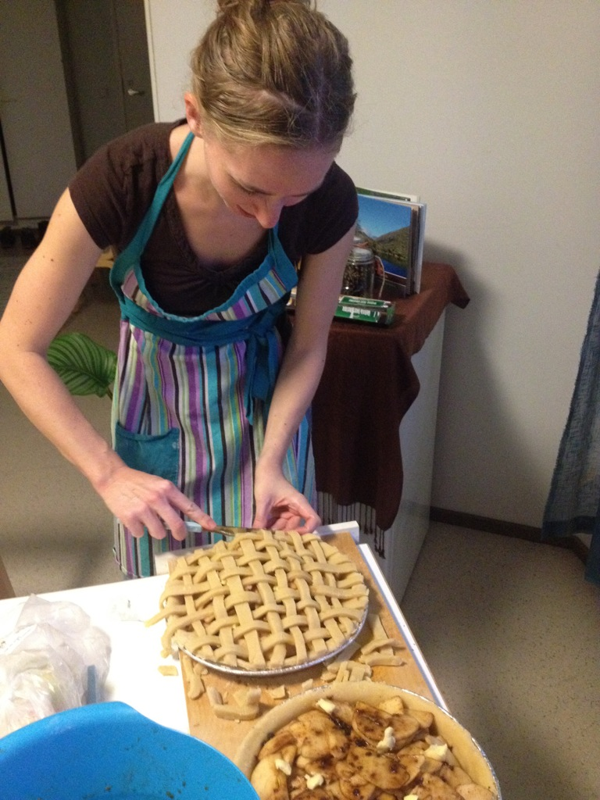
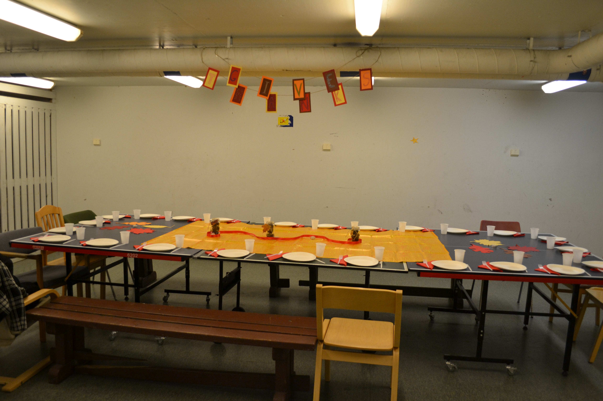
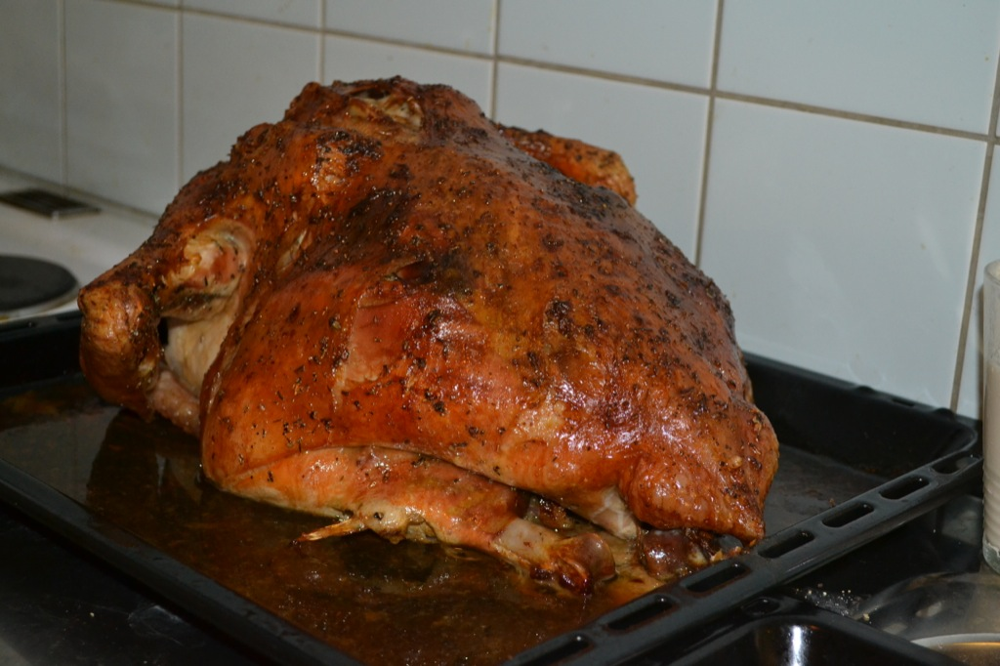
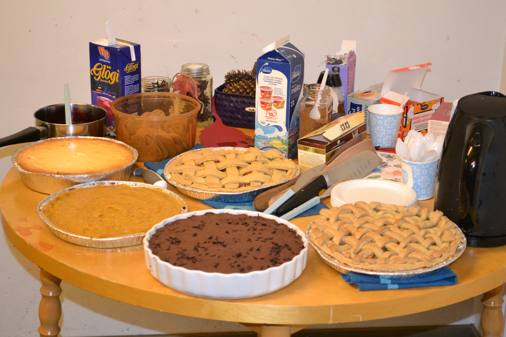
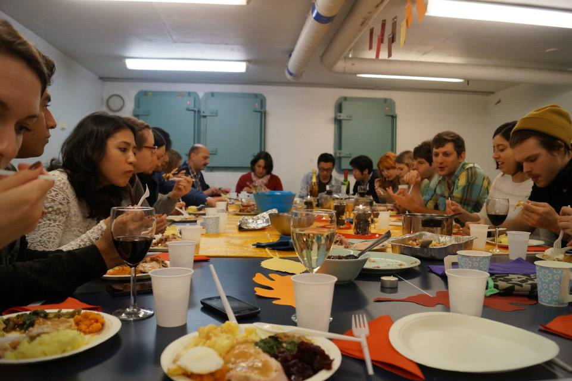

What do you do when you're in Finland on Thanksgiving? More importantly, what do you do when you're in Finland on Thanksgiving when your mom, aunties, and grammas aren't there too cook a feast for you?

 Answer: Enlist your American friend to help host Thanksgiving dinner. Oh, and invite 20 friends to introduce the special holiday to them, too!

 Annie (my American friend) and I met up to plan the menu and to deligate dishes. We decided I'd be in charge of the gravy, green bean casserole, stuffing, and cheesecake. Annie would take the sweet potato casserole, cranberry sauce, salad, apple pie, pumpkin pie, and cheese puff pastries for an appetizer. Together, we would make the mashed potatoes, pigs in a blanket, and try our hardest to tackle the bird. THE bird. We were definitely nervous because neither of us had cooked a turkey before or paid attention to how our moms did. So, of course, I immediately emailed my mom (shoutout to my mommy - love you!!) to ask for advice on how to survive this holiday.

 Thursday night, Annie and I went to Prisma (the equivalent to Target or Walmart), grabbed a couple of shopping carts, and we were off. We did remember, for the most part, to look up the Finnish word for our ingredients. But when the translations are even the slightest different than what we have on our list...well, let's just say we have trust issues. After a bit of time, we had everything crossed off our list so we checked out, packed our bags, and headed to the bus stop. Transporting groceries is definitely not as simple by bus as it is by car. I do miss the luxury of being able to take the shopping cart right to your car, load the groceries in the back seat, and drive right to your front door...but instead, we struggled to carry the six or seven cloth bags filled up with groceries to the bus stop. The bus was a few minutes late but when we finally loaded the bus, it felt nice to sit down. But waaait - the bus pulled up to our stop and wouldn't you guess it, a few of the bags tipped over and spilled out groceries on the floor of the bus. Now busses don't like waiting...ever. So, we already felt silly carrying so many bags, then add on top of that a struggle to reach under the bus seat and collect the spilled out contents in record time so the bus driver and passengers remained happy.

 Ok, purchase groceries - check.

 Next on the docket is cooking. We got together on Saturday to pre-cook and prepare everything possible. We made all the desserts and one of Annie's friends from Russia came over to help so we were able to get the sweet potato casserole made, too. It is amazing how much one extra set of hands can help and speed up the process. Remember when I had mentioned we had some trust issues with some translations? Well, turns out those trust issues weren't so unrealistic. In my attempt to prepare the stuffing, I began to brown the "sausage" which turned out to be liver. Yep, liver. So, I did a more thorough investigation into the correct translation of pork sausage and took one more trip to the grocery store. Overall, we were cooking from around 12 - 5 on Saturday and decided that we should start cooking around 9 am on Sunday to be able to sit down to eat for 3 pm.

<figure>
    
    <figcaption> Prepping the desserts on Saturday. </figcaption>
</figure>

Sunday morning, we prepped the turkey and got it in the oven around 10. Thanksgiving in Finland was officially underway. We had reserved the common room in Annie's apartment building. The room had two bathrooms, a kitchen, and a large, open room with a ping pong table and benches that worked quite nicely for a dinner table for our friends. The only downside was that two burners on the stove didn't work, which made cooking a little more difficult. 

<figure>
    
    <figcaption> The table all set and ready for a feast! The banner says "Give Thanks". </figcaption>
</figure>

With only a few minor burns, the bird was done, food was prepared and our friends had arrived.

<figure>
    
    <figcaption> Look at that beauty! We did it! </figcaption>
</figure>

We had a total of 12 countries represented at our Thanksgiving table. It was so amazing to share such a special holiday with friends from around the world. We explained the history of Thanksgiving and how Americans celebrate the holiday with family (eat until you're full and then eat some more)!

<figure>
    
    <figcaption> The dessert table was a popular hangout spot. </figcaption>
</figure>

Luckily, everyone seemed to enjoy the food and the company.

<figure>
    
    <figcaption> The table was full, which was perfect :) </figcaption>
</figure>

Thanksgiving 2014 was a Finnish success! 
