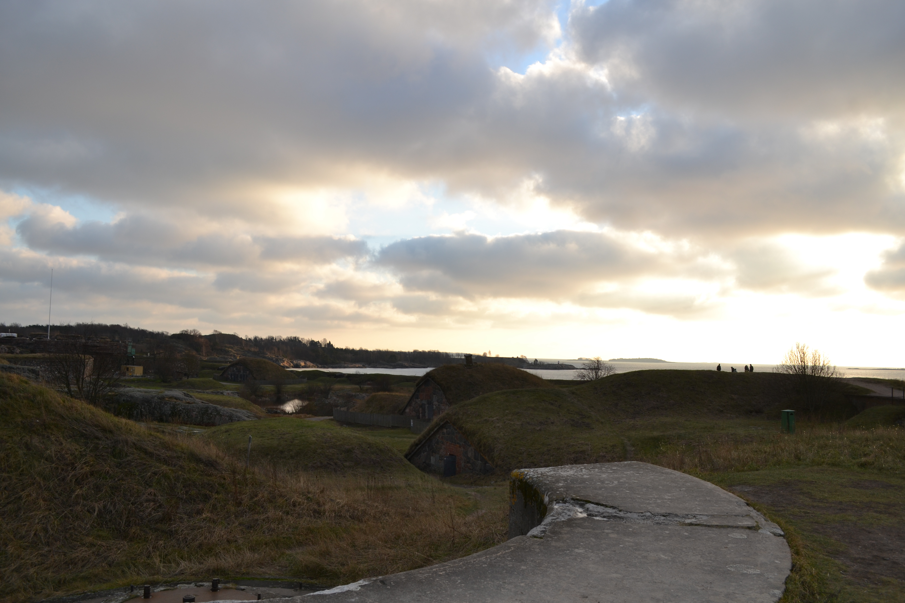
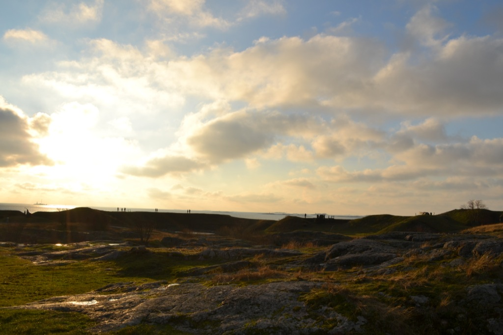
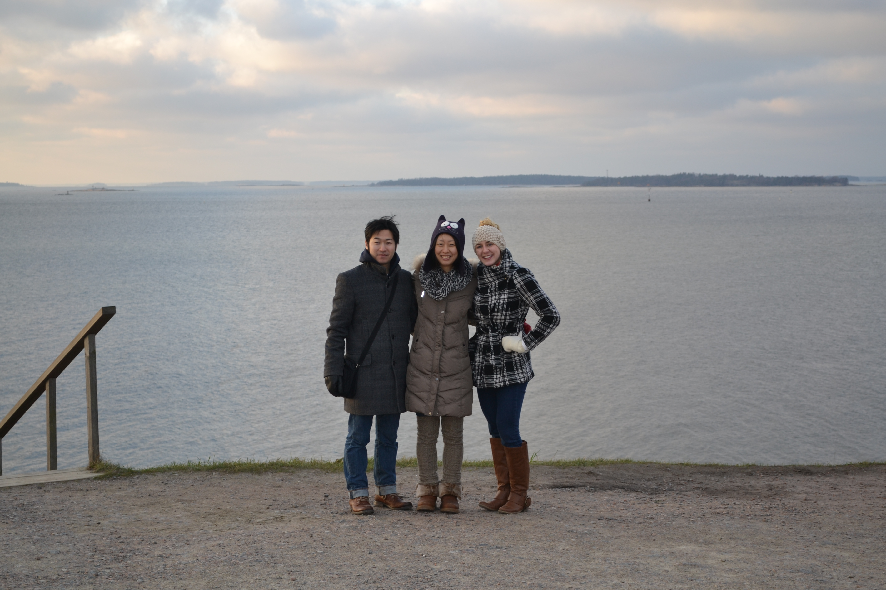
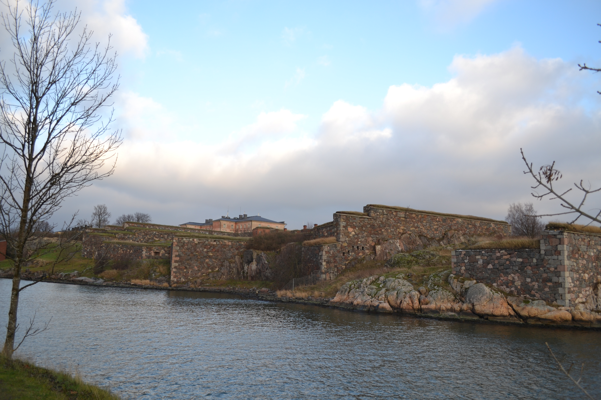
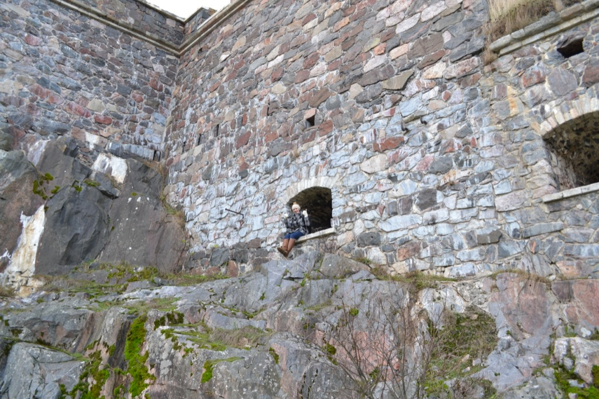
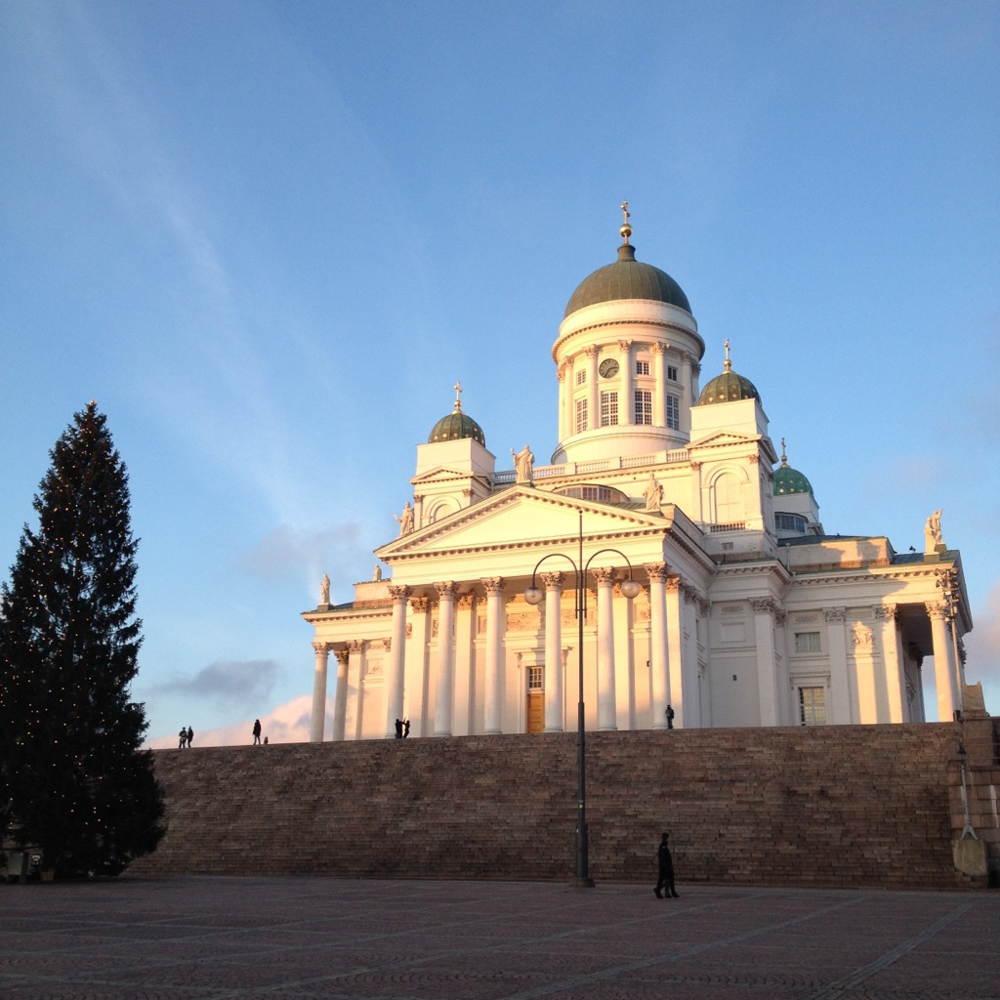
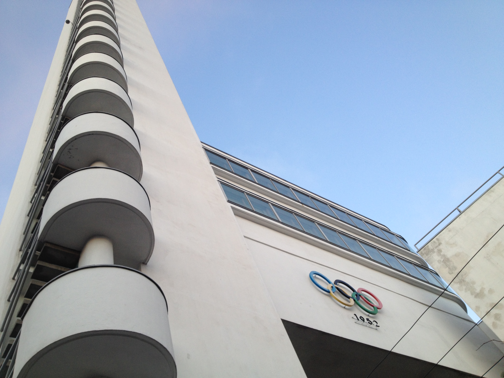
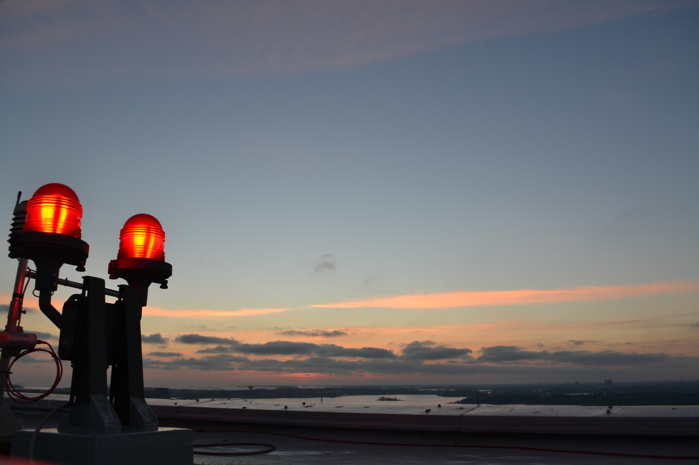
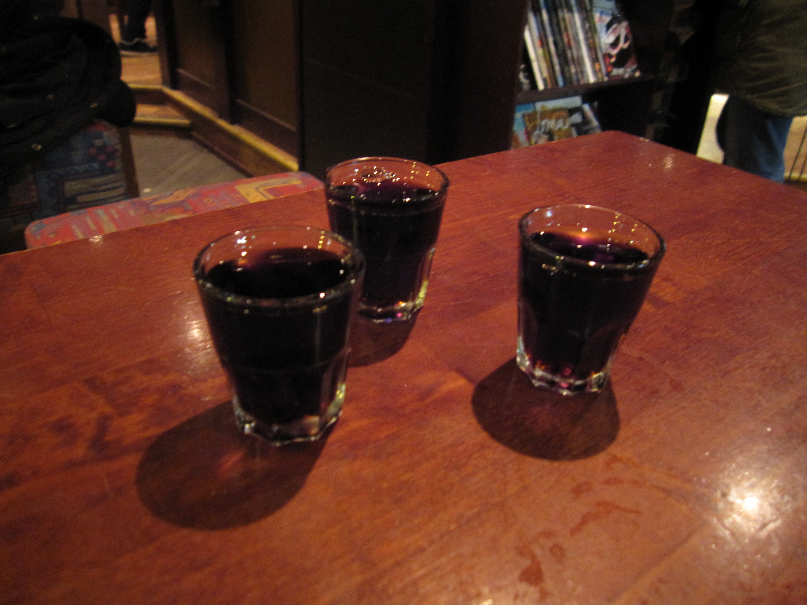
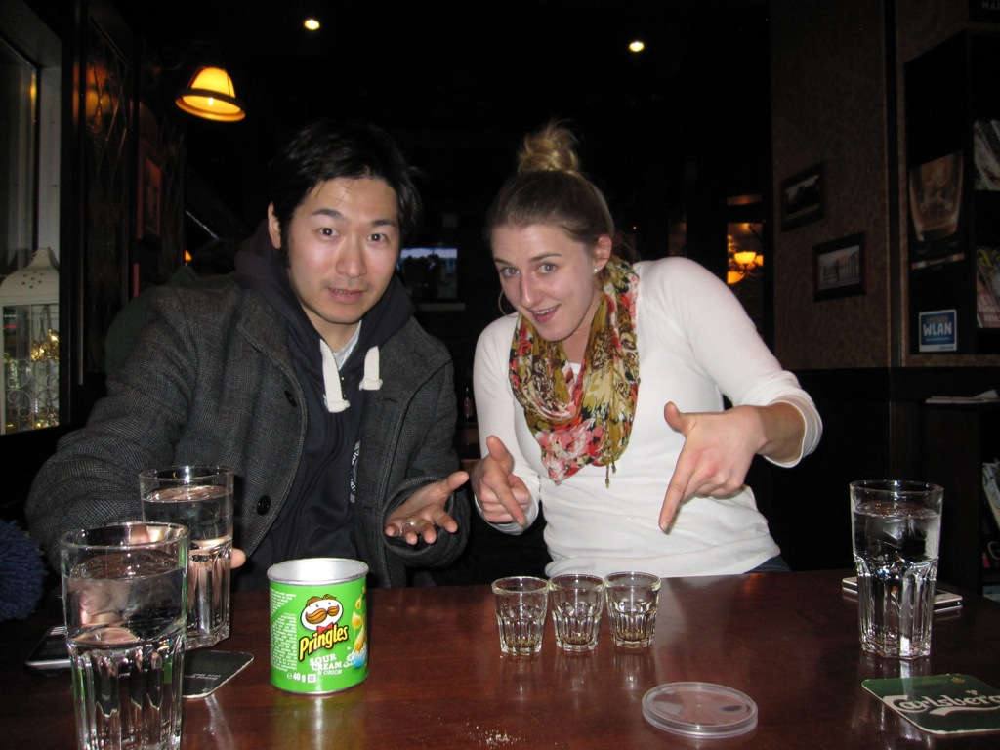

Since it is not blocked by the Archiapelago Islands like Turku, Helsinki is much colder. This was something that I didn't plan for but after you walk around outside in below freezing temperatures for a few hours, you kind of just forget how cold you are.

When we arrived in the country's capital, we jumped on the ferry to Suomenlinna, an old fortress. It is a short 15 minute ride out to the island. 

<figure>
    
    <figcaption> Just a couple small portions of the beautiful Suomenlinna. There are shelters built into the ground almost everywhere you look. </figcaption>
</figure>

The views were absolutely gorgeous:  sun was shining, skies were blue, and the sea went on forever.

<figure>
    
    <figcaption> My travel companions, Yasuhito and Junko, on the edge of Suomenlinna. </figcaption>
</figure>

Large stone walls surrounded the island. These walls had strategically placed holes for lookouts, cannons, or the barrel of a gun.

<figure>
    
    <figcaption> We weren't able to climb all the way up, of course. But we had to try! </figcaption>
</figure>

We got to visit a couple of cathedrals in country's capital. Since Finland was once part of Russia, the architecture of the old buildings still holds the Russian style. 

<figure>
    
    <figcaption> We were able to go into the first which was filled with paintings and candles. The second had a service being held so we didn't get to explore the inside. </figcaption>
</figure>

The Olympics were held in Helsinki in 1952 and the old stadium is still open as a museum. Part of the stadium includes a tower that overlooks the city. 

<figure>
    
    <figcaption> The elevator of the tower takes you up only part way to the top. The rest of the way (only about 2 flights) is stairs that are expose to outside. So, it was a very chilly sightseeing event but totally worth it.  </figcaption>
</figure>

To warm ourselves up at the end of the night, we headed to the pub and enjoyed some Gloggi. It's a traditional hot drink made of fruit, spices, and sugar. For a nice evening beverage, it's served with hot red wine mixed in, too, with a few almonds and raisins in the bottom of the mug. We needed an additional kick so we ordered Salmiakki shots, another traditional drink here. Salmiakki is a very popular candy that tastes like salty black licorice. The Finns have a unique palate. The shot is Salmiakki-flavored vodka that very dark and somewhat viscous.

The "cheers" here usually take some time because we say it in every language possible. Since I was only with my Japanese friends, we said "Kanpai, Kippis, Cheers" to represent Japanese, Finnish, and English.

<figure>
    
    <figcaption> Bottoms Up! </figcaption>
</figure>

If you ever have the chance to visit Helsinki, I would highly recommend you check out these cool places (and drinks)!
