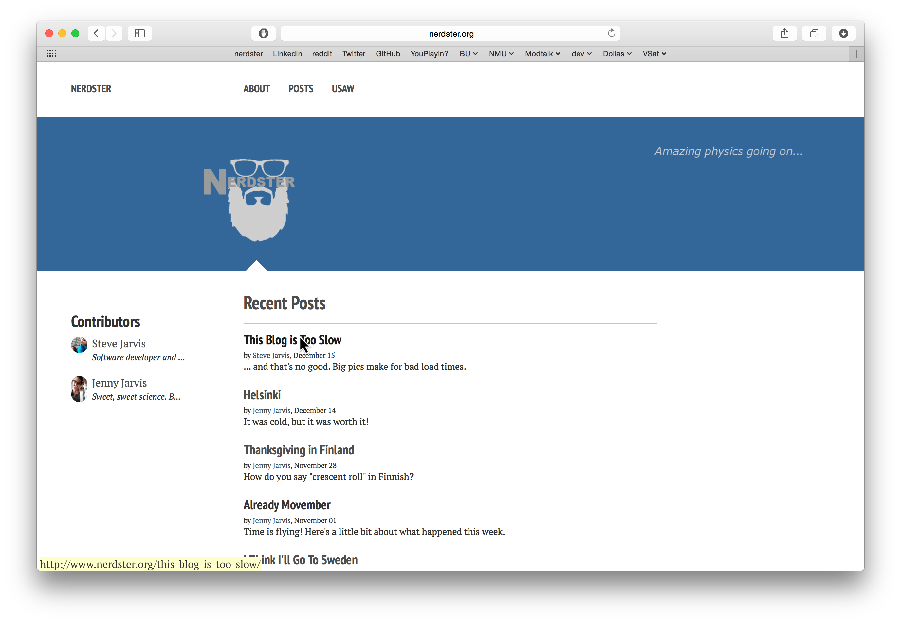

Safari seems to be the only modern browser that doesn't display the destination
of links when hovering with the cursor (by default). "Where To?" is an extension
that adds that functionality in a very simple manner.

After page load, Where To? processes all the links and displays their
href destinations in a small status bar as they're moused over.

<figure>
    
    <figcaption>Where To? adds a subtle yellow status box in the bottom left of
    the window.</figcaption>
</figure>

It's available on [GitHub](https://github.com/stevejarvis/whereto), just
[download](https://github.com/stevejarvis/whereto/blob/master/bld/whereto.safariextz?raw=true)
and double-click to install.

Even before I started I figured this feature must be available somehow; it's too
widely used and available almost everywhere else. But I decided it'd be more fun
to learn how to write a Safari extension than search for other solutions.
Afterwards, I realized that this feature is, in fact, already available in
Safari, it's just disabled by default (see View -> Show Status Bar). Where To?
still has its merits, though, like taking minimal browser real estate and
displaying action hrefs in addition to full URLs.

So that's that, it's a simple extension that adds a feature I was wishing for.
