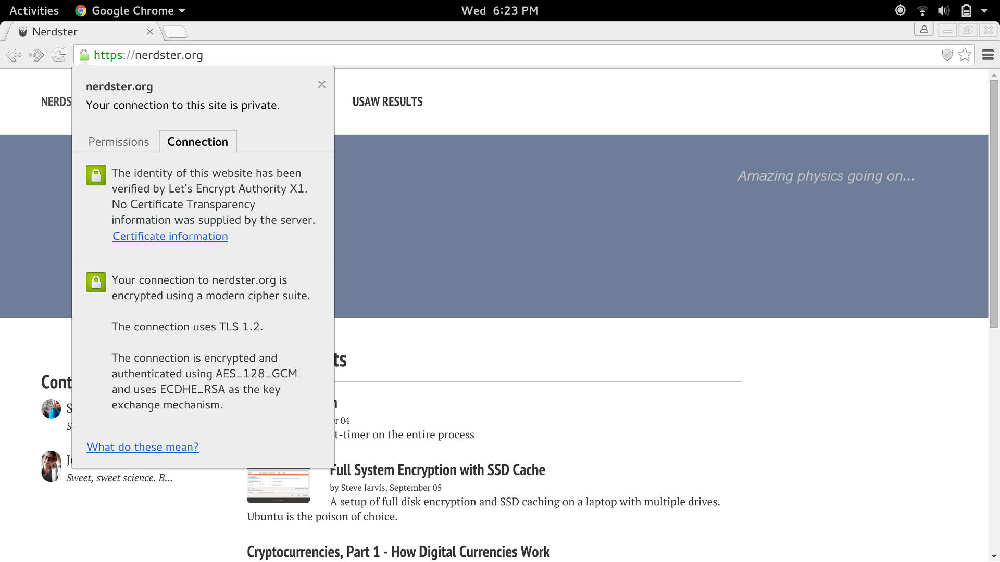

This is largely for my own records, since I'm sure to move this again and/or
break everything someday, but it'd be helpful for anyone heading down a
similar path. Hours ago this site was hosted on GitHub Pages, which is awesome
in its own right, but has its shortcomings. The biggest of which (for me)
became the inability to offer SSL with a custom domain.[^1]
I easily ignored this for a while, because I wasn't
willing to pay for a certificate to secure a simple blog, but now that
[Let's Encrypt](https://letsencrypt.org/) has come to save the privacy day, I'm
inclined to make a move.

Long story short, the move was to get a VPS on Digital Ocean and run the site
from there on Nginx. There are three general tasks to hit this goal:

 * Install and configure Nginx over http.
 * Get Jekyll auto-generating to the right place on new Git submissions.
 * Get a cert from LetsEncrypt and direct all http traffic to https.

Where it matters, the solution will be specific to the Red Hat family (Fedora
23, specifically).

<figure>
    
    <figcaption>The ultimately trusted connection, as shown in Chrome. I
    normally use Firefox, but it took a little longer to get Firefox to totally
    trust it. I had some mixed media (over http) that caused Firefox to give
    warnings for a bit. Interestingly, Firefox is much harder on issues of
    security, safety, and privacy than Google's Chrome.</figcaption>
</figure>

## Nginx Setup

I'd only ever used Apache, but the talk of Nginx being "lightweight" was
attractive, since I planned to get the cheapest Droplet Digital Ocean had to
offer. The basic setup was exceedingly simple, and the only
difference from the other tutorials I came across was the location of the config
file. Likely due to the distro, but the config in question on Fedora is
/etc/nginx/nginx.conf (not /etc/nginx/sites-available/). Simply change the root
path to wherever the root of the site is planned to be.

## Jekyll Auto-Generation

[Digital Ocean's own tutorial](https://www.digitalocean.com/community/tutorials/how-to-deploy-jekyll-blogs-with-git)
was very on the money here. I didn't involve RVM, though, and I think that made
dependency management a little more frustrating. Solving a "missing
development tools" error thrown by gem ate up some time,
and the missing package turned out to be something provided by rpm-build ("dnf
install rpm-build ruby ruby-devel" should satisfy in the end). The necessary
gems are "gem install jekyll jekyll-sitemap pygments.rb".

In short, the idea is to use Git's hooks to generate and publish the site at the
end of each received push. The hook is just a bash script, and looks something
like this:

    #!/bin/bash -l
    GIT_REPO=/home/git/nerdster.org.git
    TMP_GIT_CLONE=$HOME/tmp/git/nerdster
    PUBLIC_WWW=/usr/share/nginx/nerdster

    git clone $GIT_REPO $TMP_GIT_CLONE
    jekyll build --source $TMP_GIT_CLONE --destination $PUBLIC_WWW
    rm -Rf $TMP_GIT_CLONE
    exit

But unless I missed something, the linked tutorial skipped the issue of
permissions. No user but root will be able to throw new files under nginx's
web directory. I solved this by creating a www-data group and adding the
necessary users to it (me and git), as well as editing the ownership of
/usr/share/nginx/nerdster to root:www-data. This also requires permission bits
of 775 instead of 755.

## Cert from Let's Encrypt and Redirects

At the time of writing, most tutorials suggest that the letsencrypt client is
pulled and built from source, but it's already in Fedora's default repos.[^2]
Besides that simplification, Digital Ocean again proved to have a reliable
[set of steps to pull a certificate](https://www.digitalocean.com/community/tutorials/how-to-secure-nginx-with-let-s-encrypt-on-ubuntu-14-04).
Most of the linked tutorial isn't necessary since letsencrypt is already in the
repos, and the finer points are just to request a cert (after A records are as
expected) and update Nginx to redirect port 80 traffic to port 443. The cert is
initially requested by simply:

    letsencrypt certonly --standalone

The standalone solution does start its own web server for communication and
verification of the Internet address, so nginx must be stopped for a moment.
Once that completes, the full certificate chain and private key are linked in
/etc/letsencrypt/live/nerdster.org/[fullchain.pem|privkey.pem], respectively,
and need to be added to the SSL section of the default nginx config (still
/etc/nginx/nginx.conf). Here's what the server sections of the current config
look like (with a redirect from www to non-www, but minimally modified other
than that):

    # Redirect www to plain domain for consistency
    server {
        server_name  www.nerdster.org;
        # The $scheme variable would be the simple redirect, but no use
        # redirecting again for SSL later if that's the case.
	    return 301 https://nerdster.org$request_uri;
    }

    # Make 80 redirect to 443/SSL
    server {
        listen       80;
        server_name  nerdster.org www.nerdster.org;
	    return 301 https://$host$request_uri;
    }

    # Settings for a TLS enabled server.

    server {
        listen       443 ssl;
        listen       [::]:443 ssl;
        server_name  nerdster.org www.nerdster.org;
        root         /usr/share/nginx/nerdster;

        ssl_certificate "/etc/letsencrypt/live/nerdster.org/fullchain.pem";
        ssl_certificate_key "/etc/letsencrypt/live/nerdster.org/privkey.pem";
        ssl_session_cache shared:SSL:1m;
        ssl_session_timeout  10m;
        ssl_ciphers PROFILE=SYSTEM;
        ssl_prefer_server_ciphers on;

        # Load configuration files for the default server block.
        include /etc/nginx/default.d/*.conf;

        location / {
        }

        error_page 404 /404.html;
            location = /40x.html {
        }

        error_page 500 502 503 504 /50x.html;
            location = /50x.html {
        }
    }

## C'est Fini

And that's that, we got a sweet little green lock in the address bar. The site
is auto-generated and republished every time a change is pushed to the
repository and it's all protected by TLS. The domains nerdster.org,
http://nerdster.org, www.nerdster.org, and http://www.nerdster.org all
redirect to https://nerdster.org.

[^1]: I'm sure it will be possible soon, but not at time of writing. [See this bug.](https://github.com/isaacs/github/issues/156)
[^2]: Which is seriously impressive and a prime example of why I like
    Fedora. Let's Encrypt
    [entered public beta on December 3rd](https://www.eff.org/deeplinks/2015/12/lets-encrypt-enters-public-beta)
    and was
    [in the default repos by December 14th](https://fedoramagazine.org/letsencrypt-now-available-fedora/). Incredible.
