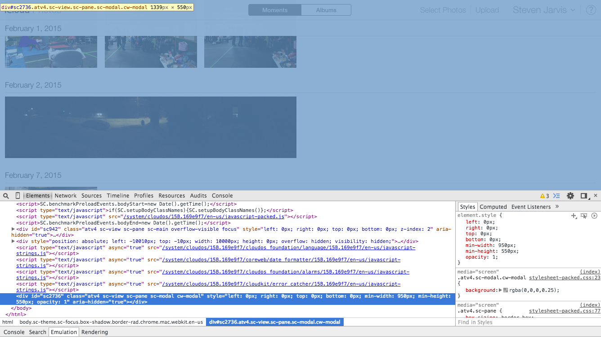

Photos on iOS automatically uploads photos and videos to iCloud. That's neat,
because it lets me keep up-to-date albums on OS X with no real
effort. However, videos are not synced with iPhoto, and unbeknownst to me
they're also removed from my phone after some time.

That means, after 30ish days, the only place my videos exist is in iCloud. I
learned this after I realized I couldn't get the videos off my phone, and shortly
following I learned I actually have an account at
<a href="https://www.icloud.com" target="_blank">icloud.com</a>. A bit
annoying I think, but unfortunately not that surprising.

So, whatever, all would be fine
and well, except every time I try to use the Photos app at iCloud.com
I get the following unresponsive error. Every
time. Even if the page actually loads in less than a second.

<figure>
    
    <figcaption>Photos immediately throws this error, and the only thing making
    the page unresponsive is the error itself.</figcaption>
</figure>

So, since I can watch the page load despite the error, I had a good
feeling the page is actually just fine and the only real problem is the  dialog
that's now preventing me from using the application. The only options to click are
"Reload", which cycles this same process, and "Send to Apple", which sends an
error report and <i>then</i> cycles this same process.

Anyway, I'm no web developer but I know a couple things. "Fixing" iCloud is even
simpler than
[defeating a $40 million paywall](http://www.niemanlab.org/2011/03/that-was-quick-four-lines-of-code-is-all-it-takes-for-the-new-york-times-paywall-to-come-tumbling-down-2/).
Just open the developer tools and delete the error dialog.

<figure>
    
    <figcaption>The error dialog is done in javascript, just delete the element
    to get it out of the way.</figcaption>
</figure>

Once that's gone, there's one more "shield thingy" element spanning the entire page and
preventing interaction. It might be difficult to find by name, but it's the
element starting in the upper corner and spanning the entire height and width of
the page. Once it's gone you're all set to download the videos iOS shipped
off your phone.

<figure>
    
    <figcaption>There's an extra element that grays out and covers the actual
    page. After removing it as well as the original error the Photos app is... good as new?</figcaption>
</figure>

So, obviously this isn't actually "fixing" anything, but at least you can get
your videos.
