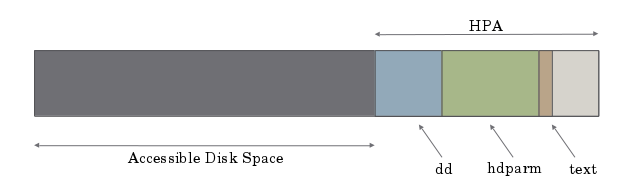

There was a challenge presented at school to "hide" data on a hard drive using
the HPA (host protected area) or DCO (disk control overlay). Data in
these regions is immune to common formatting tools and
invisible in file explorers. I took the challenge, and there are surely many
paths to achieve this goal, but my affinity for *nix dictated that I use the
GNU applications hdparm to modify the HPA and dd to write data.

Part of the challenge included providing copies of the applications used to do
the deed, so I intended to write the applications themselves to the HPA for
reproduction.

### System

* Ubuntu 15.04
* Linux 3.19.0-21
* dd 8.23
* hdparm 9.43

### Getting Data into the HPA
The drive I was handed came with no HPA; every one of the 312581808
sectors was usable.

~~~~~~
  % sudo hdparm -N /dev/sdc

  /dev/sdc:
  max sectors   = 312581808/312581808, HPA is disabled
~~~~~~

So, how big of an HPA should I make? A 1 Gb HPA seemed like a good choice.
1073741824 bytes in a Gb and 512 byte sectors = 2097152 sectors in a Gb.[^1]
Therefore, 312581808 - 2097152 = 310484656 sectors that I want to be visible,
in the end, so the HPA shall start at sector 310484657.

Also, along the way, I learned I need to power cycle the drive for HPA changes
to be "usable". Edits via hdparm are not respected on the fly.

So, with the HPA disabled, I copied dd to the first sector of what will be the
HPA (yeah, meta).

~~~~~~
  % sudo dd of=/dev/sdc seek=310484657 < $( which dd )
  117+1 records in
  117+1 records out
  60232 bytes (60 kB) copied, 0.035655 s, 1.7 MB/s
~~~~~~

Next I want to write the hdparm application immediately following dd, but I need
to calculate where that is. The dd application is 60232 bytes starting at sector
310484657.[^2] 60232/512 = 117.6 sectors. 310484657 + 118 = sector
310484775 for the start of hdparm.

~~~~~~
  % sudo dd of=/dev/sdc seek=310484775 < $( which hdparm )
  201+1 records in
  201+1 records out
  103056 bytes (103 kB) copied, 0.0445456 s, 2.3 MB/s
~~~~~~

Excellent, but I thought I should write some regular (easily verifiable) text to
the space as well. dd copied 103056 bytes for hdparm, starting at sector
310484775. 103056 bytes / 512 bytes per sector = 201.3 sectors.
310484775 + 202 = sector 310484977.

~~~~~~
  % sudo dd of=/dev/sdc seek=310484977 <<< "Hi. I used dd and hdparm. You can find
  dd at the 60232 bytes starting at sector 310484657. Hdparm is the 103056 bytes
  following sector 310484775."
  0+1 records in
  0+1 records out
  146 bytes (146 B) copied, 0.0479726 s, 3.0 kB/s
~~~~~~

Now that all I want in the HPA is written to the proper spaces on the disk, use
hdparm to reset the hard drive parameters and set an HPA to start at sector
310484656.

~~~~~~
  % sudo hdparm --yes-i-know-what-i-am-doing -N p310484656 /dev/sdc

  /dev/sdc:
    setting max visible sectors to 310484656 (permanent)
    max sectors   = 310484656/312581808, HPA is enabled
~~~~~~

And is that not the best argument ever? ``--yes-i-know-what-i-am-doing''?
Now we're all set, but I still want to make sure we can format the drive, write
0's, etc and not effect the data I have in the HPA. So I did a power cycle of
the drive at this point (and after reconnect the drive now shows up as 159 GB,
as expected).

I formatted the disk, writing all zeros.

### Verification

The hd and dd tools won't read sectors in the HPA, so I need to disable it to
verify the data is there.

First, I'm hoping the 60232 bytes from sector 310484657 is the same as dd.

~~~~~~
  % sudo dd if=/dev/sdc of=./ddhpa skip=$(( 310484657 * 512 )) bs=1 count=60232
  60232+0 records in
  60232+0 records out
  60232 bytes (60 kB) copied, 0.974162 s, 61.8 kB/s
  % diff ddhpa $( which dd )
  <no output>
~~~~~~

So they are identical, dd is verified in the HPA. In the same way, 103056 bytes
from sector 310484775 needs to be the same as hdparm.

~~~~~~
  % sudo dd if=/dev/sdc of=./hdparmhpa skip=$(( 310484775 * 512 )) bs=1 count=103056
  103056+0 records in
  103056+0 records out
  103056 bytes (103 kB) copied, 1.54483 s, 66.7 kB/s
  % diff hdparmhpa $( which hdparm )
  <no output>
~~~~~~

Also good. Now let's check out the text file I wrote with hd.

~~~~~~
  % sudo hd /dev/sdc -s $(( 310484977 * 512 )) -n 146
  25033fe200  48 69 2e 20 49 20 75 73  65 64 20 64 64 20 61 6e  |Hi. I used dd an|
  25033fe210  64 20 68 64 70 61 72 6d  2e 20 59 6f 75 20 63 61  |d hdparm. You ca|
  25033fe220  6e 20 66 69 6e 64 20 64  64 20 61 74 20 74 68 65  |n find dd at the|
  25033fe230  20 36 30 32 33 32 20 62  79 74 65 73 20 73 74 61  | 60232 bytes sta|
  25033fe240  72 74 69 6e 67 20 61 74  20 73 65 63 74 6f 72 20  |rting at sector |
  25033fe250  33 31 30 34 38 34 36 35  37 2e 20 48 64 70 61 72  |310484657. Hdpar|
  25033fe260  6d 20 69 73 20 74 68 65  20 31 30 33 30 35 36 20  |m is the 103056 |
  25033fe270  62 79 74 65 73 20 66 6f  6c 6c 6f 77 69 6e 67 20  |bytes following |
  25033fe280  73 65 63 74 6f 72 20 33  31 30 34 38 34 37 37 35  |sector 310484775|
  25033fe290  2e 0a                                             |..|
  25033fe292
~~~~~~

Now that everything is verified, re-enable the HPA, starting at sector
310484656.

~~~~~~
  % sudo hdparm --yes-i-know-what-i-am-doing -N p310484656 /dev/sdc

  /dev/sdc:
    setting max visible sectors to 310484656 (permanent)
    max sectors   = 310484656/312581808, HPA is enabled
~~~~~~

And that's that.

<figure>
    
    <figcaption>Final general layout of the disk.</figcaption>
</figure>

### Summary
Using hdparm and dd on Ubuntu Linux, there's:

  * A 1 Gb HPA starting from sector 310484656.
  * dd for 60232 bytes starting from sector 310484657.
  * hdparm for 103156 bytes starting from sector 310484775.
  * ASCII text, relaying this same summary, for 146 bytes starting from
    sector 310484977.

### Footnotes

[^1]: I copied only 1 block with dd, and it copied 512 bytes. So I knew it would treat a sector as 512 bytes by default.
[^2]: Given by the dd output.
