## Overview
This is an introduction to software defined networking concepts,
including this hands on tutorial with OpenFlow, OpenDaylight (ODL), and
OpenVSwitch (OVS). In this exercise, we'll use Mininet to emulate three hosts
connected to a single OVS switch, then connect the switch to an ODL controller.
By issuing commands trough the ODL controller, we'll insert network flows on the
switch to reroute traffic destined to host 2 from host 1 to host 3 instead,
while also rewriting L2 and L3 addresses so host 1 never knows any different.

Estimated time to complete is 40 minutes (very roughly). This exercise
was inspired by a very similar presentation by Geddings Barrineau at
the GENI networking workshop at BU earlier this Spring.[^1][^2]

## Setup

### Installing Applications
Instructions assume Ubuntu 16.04.

    $ sudo apt update && sudo apt install mininet open-jdk-8-jdk vim tmux wireshark libxml2-utils
    $ echo "export JAVA_HOME=/lib/jvm/java-8-openjdk-amd64/" >> ~/.bashrc
    $ wget https://nexus.opendaylight.org/content/groups/public/org/opendaylight/integration/distribution-karaf/0.4.2-Beryllium-SR2/distribution-karaf-0.4.2-Beryllium-SR2.tar.gz
    $ tar xvzf distribution-karaf-0.4.2-Beryllium-SR2.tar.gz

#### OpenDaylight
After installing features, the controller is also ready and waiting for
connections.

    $ cd distribution-karaf-0.4.2-Beryllium-SR2
    $ ./bin/karaf
    > feature:install odl-l2switch-switch odl-dlux-all odl-openflowplugin-flow-services-ui odl-mdsal-apidocs

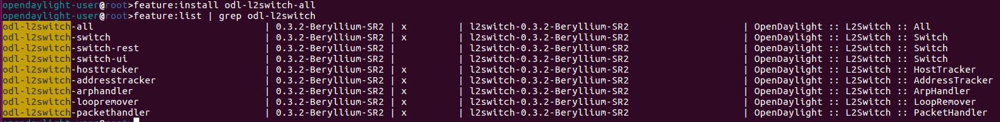

#### Mininet

Mininet is already installed, "apt install" did it all.

## Running

### Start the Controller

If you are just joining and don't yet have Opendaylight running, start it by:

    $ cd distribution-karaf-0.4.2-Beryllium-SR2
    $ ./bin/karaf

All the previously installed features are automatically loaded and started.
Then in Firefox, load the web UI, served on port
8181: `http://localhost:8181/index.html`

You should be presented with a login screen, the credentials for DLUX
(the openDayLight User eXperience) are `admin:admin`. After logging in you
should see essentially a blank slate, which is perfect, since there are not
hosts or switches on this network yet!

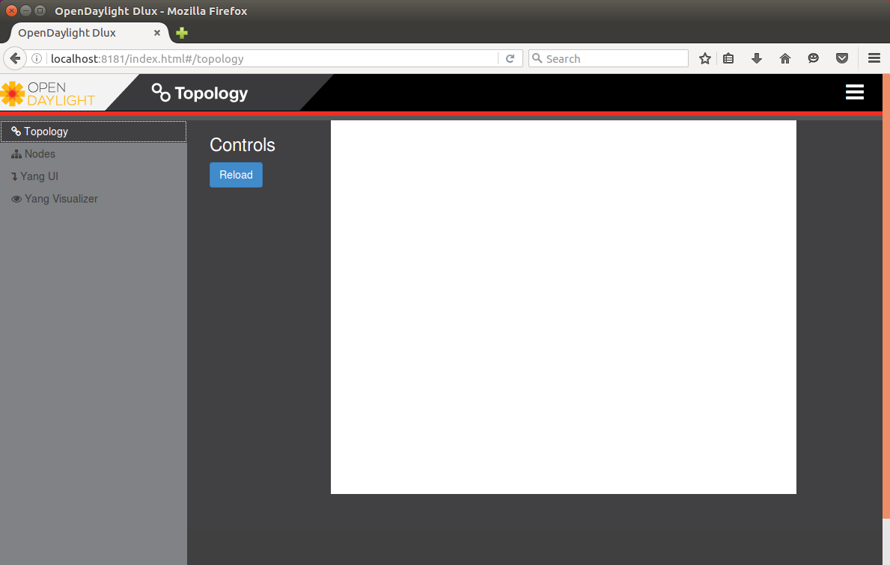

_Note: Also, you can see that there is in fact *something* bound to port 6633,
the default port for OpenFlow traffic (it's OpenDaylight)._

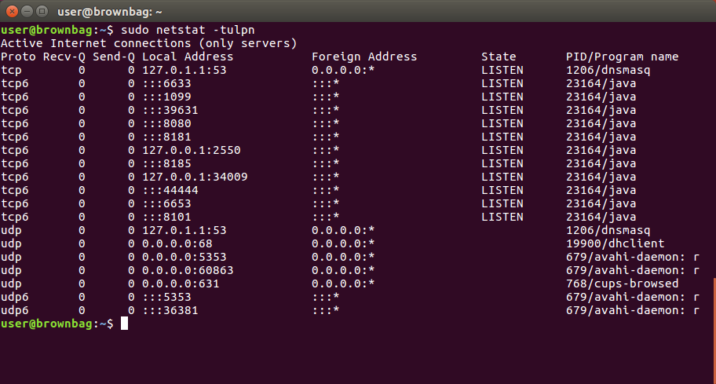

### Make a Network

Now's time to come up with a network. [Mininet](http://mininet.org) is our
platform of choice. It offers effectively instant architecture of arbitrary
complexity, running real kernel and switch code. Here's a snippet of their
impressive sales pitch.

> Mininet networks run real code including standard Unix/Linux network
> applications as well as the real Linux kernel and network stack [...].
> Because of this, the code you develop and test on Mininet, for an OpenFlow
> controller, modified switch, or host, can move to a real system with minimal
> changes, for real-world testing, performance evaluation, and deployment.

Try Mininet's equivalent of "Hello World".

    sudo mn --test pingall --topo single,3

This must be done as root (reminder: password is "network"). What this does is
initializes a topology of 3 nodes connected to 1 switch and executes a
"everybody ping everybody" test for connectivity.

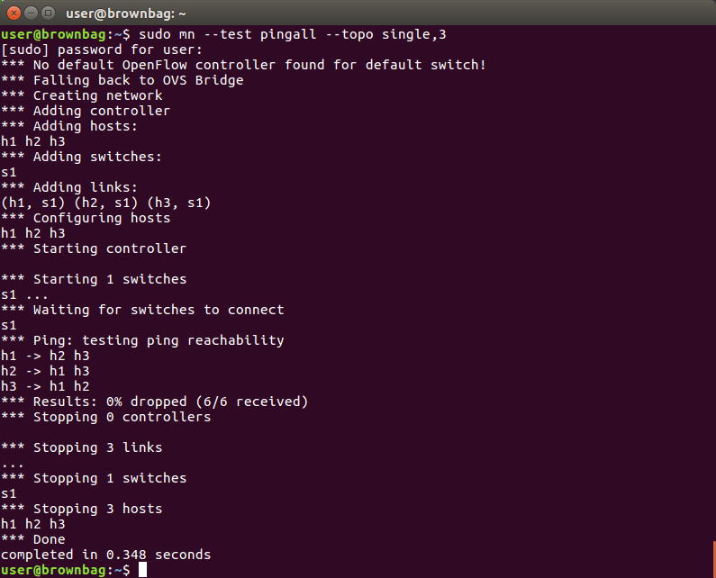

Neat. What happens if we don't provide a test to run? Well, try it.

    sudo mn --topo single,3

Instead of running tasks and exiting it provides a shell. From this shell you
can execute mininet commands, including executing \*nix applications on the
emulated hosts (try `h1 ifconfig`, `h2 ping h3`, and `xterm x2` for a real
shell, for example).

Notice the start of stdout in these runs prints a warning that "there's no
controller!" We have the controller running, but this emulated network knows
nothing of it. So now let's go for the real deal and hook up our network to the
ODL controller.

    sudo mn --topo single,3 --mac --controller=remote,ip=127.0.0.1,port=6633 --switch ovs,protocols=OpenFlow13

Here's what these arguments do for us:

* `--topo single,3`: Use a topology with a single switch connected to three
hosts. Topology creation is also Python-scriptable for complex cases.
* `--mac`: Create these hosts with simple, non-random L2 addresses (just to
make it simpler for us).
* `--controller=remote,ip=127.0.0.1,port6633`: Provides information to find our
ODL controller. In real life would usually point to another host for control.
* `--switch ovs,protocol=OpenFLow13`: Use OpenVSwitch for our switch, and have
it run version 1.3 of the OpenFlow protocol.

Now we've added details of the controller and type of switch we want, as well as
specifying the version of OpenFlow. This time, the network looks to the
OpenDaylight switch to operate as the controller. It will by default operate as
a learning switch.

_Note: OVS might drop a couple of the initial packets as flows are being
installed, and I'm actually kinda confused and surprised by this. If drops last
longer than 1-2 pings per host there's a problem, though._

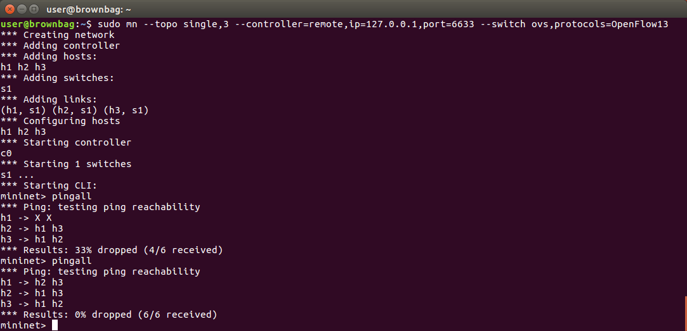

Now OpenDaylight has added flows for the 3 connected nodes, just as a learning
switch would have, and you can see this in the controller's topology (click
"Reload").

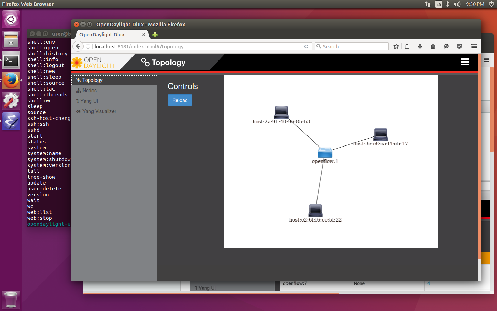

Now let's grab some more information from the controller about our
network. Navigate in the ODL UI to `Yang UI`, then expand
`opendaylight-inventory -> operational` and click on `nodes`. In the bottom
panel, you should see the path `/operational/opendaylight-inventory:nodes`. Now
click the `Send` button. This sends a GET request for the current operational status
to the ODL controller.  We can also see all information about the connected
devices and installed flows.

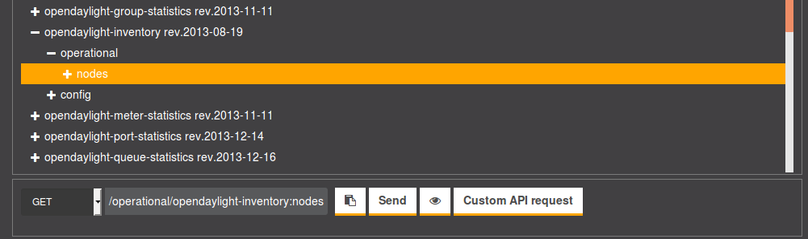

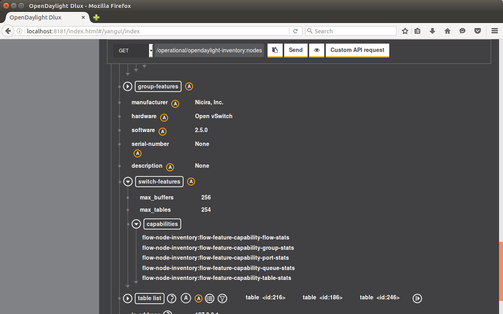

Being the programmatic type, though, we don't need to use the UI for this. We
can 1) query the controller over a RESTful interface or 2) query the switch
directly.

To query the switch for all flows in place on the switch,
enter `dpctl dump-flows` or `sh ovs-ofctl -O OpenFlow13 dump-flows s1` at the
Mininet prompt. This is direct interaction with OpenVSwitch.

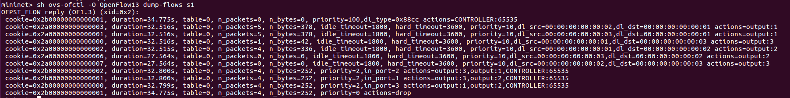

To query ODL's RESTful API, use cURL. Even though we haven't manually inserted
flows yet, you can see a number exist.

    curl -u admin:admin -H "Accept: application/xml" -X GET http://localhost:8181/restconf/operational/opendaylight-inventory:nodes | xmllint --format -

## Coordinating Our Network

Now, after all that work, we have what we would've had if we just plugged 3
hosts into any generic switch... What we can do now, though, is manipulate
traffic flows in real time and universally across all the network in the
controller's domain. To demonstrate this, we'll use OpenFlow to direct traffic
destined to host 2 from host 1 to host 3 instead, and rewrite the layer 2 and
layer 3 addresses to make it look to host 1 like the communication is truly with
host 2.

We're going to use ODL's REST API for this, and cURL to interact with the API.

### Check out connectivity

To make sure we're starting with a clean slate, let's watch ping traffic between
the three hosts.

    > xterm h1 h2 h3

In the each of the new terminals (one on each emulated host), start
`tcpdump icmp`. Then, from the Mininet prompt, run `h1 ping -c 2 h2`. You should
see two rounds of ping request/response between h1 and h2 (the same is true
with ping to/from any host right now).

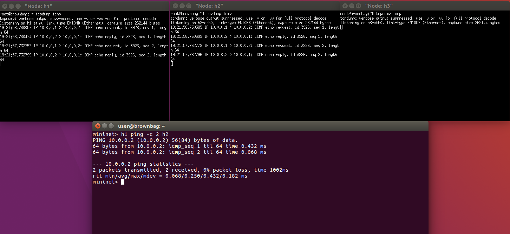

Now let's prevent h1 from bothering h2 (pretend he's a malicious host, or just
annoying). To insert flows, ODL accepts XML and JSON describing the match and
actions in PUT payloads (remember a flow is a match + action). Defining matches
and actions is really at the core of what makes software defined networking so
powerful, but in the interest of time I've already defined the flows that will
accomplish this in
[flow\_redirect\_fl.xml](../resources/sdn-bbag/flow_redirect_fl.xml)
and [flow\_redirect\_rl.xml](../resources/sdn-bbag/flow_redirect_rl.xml)
(_fl_ = forward link, _rl_ = reverse link). Read through these, cause they are
what determines the flows and behavior of the network. It's really the meat of
this whole process. The highlights include:

* Matching the 4-tuple source and destination L2 and L3 addresses over ethernet.
* Rewriting the destination L2 and L3 addresses (for the forward flow) and the
source L2 and L3 addresses (for the reverse flow).
* Setting the new output port for modified traffic.
* Setting a priority for the flow (flows and actions are executed in order of
priority).
* Storing this flow in table 0, flow 1 (forward link) and flow 2 (reverse link).

So now things get good, let's put the first flow in place!

    curl -u admin:admin -H "Accept: application/xml" -H "Content-type: application/xml" -d @sdn-bbag/flow_redirect_fl.xml -X PUT http://localhost:8181/restconf/config/opendaylight-inventory:nodes/node/openflow:1/table/0/flow/1

To view the flows on the controller:

    curl -u admin:admin -H "Accept: application/xml" -X GET http://localhost:8181/restconf/config/opendaylight-inventory:nodes | xmllint --format -

_Note: The restconf/config/ endpoint deals only with the manually placed flows,
which is why you don't see all the implicitly added flows from earlier that were
returned by the restconf/operational/ endpoint._

Now let's repeat the ping test.

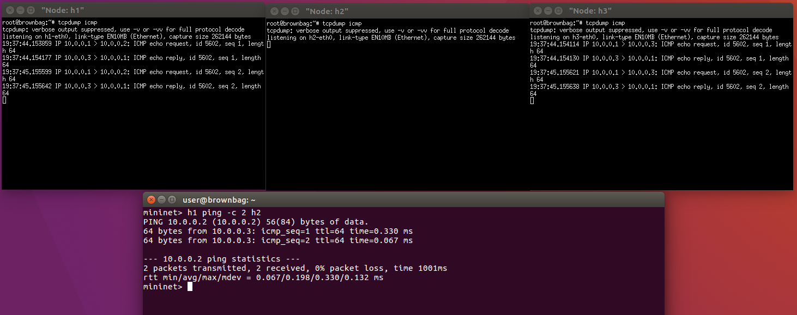

Nice, the requests never went to h2, they were redirected to h3. Notice also
though that the responses back to h1 _say_ they come from h3... not very
stealthy. So let's insert the reverse link flow and fix that.

    curl -u admin:admin -H "Accept: application/xml" -H "Content-type: application/xml" -d @sdn-bbag/flow_redirect_rl.xml -X PUT http://localhost:8181/restconf/config/opendaylight-inventory:nodes/node/openflow:1/table/0/flow/2

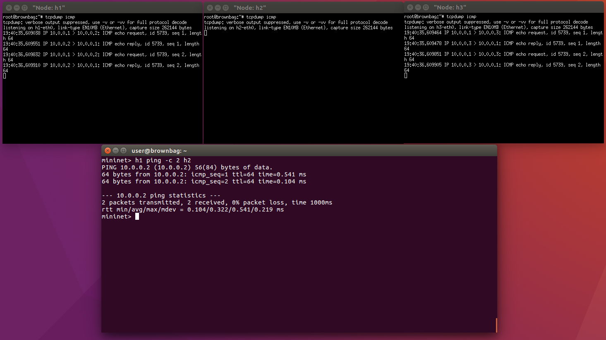

The controller redirects and rewrites addresses in both
directions. Responses to h1's pings say they're from h2, but notice h2 never
even gets any icmp traffic. In the end, we have perfect transparent redirect
from h1 -> h2; h1 thinks it's getting authentic responses from h2, but h2 never
even knows about it, h3 is handling all traffic from h1 on its behalf.

Success!

## References

[^1]: The inspiring exercise by Barrineau: <https://floodlight.atlassian.net/wiki/display/floodlightcontroller/How+to+Perform+Transparent+Packet+Redirection+with+OpenFlow+and+Floodlight>
[^2]: GENI Workshop page: <https://www.bu.edu/hic/2016/04/15/geni-regional-workshop-and-summer-camp-2016/>
