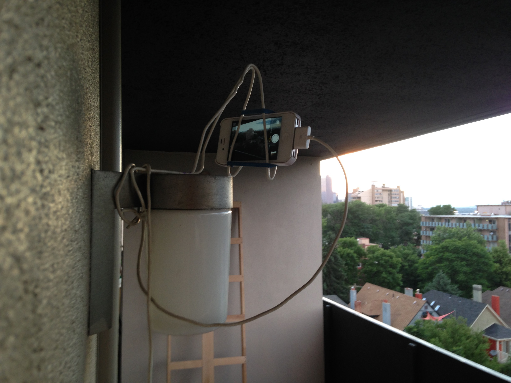

Last updated:  4:00:20 am MDT, Jun 26, 2016

<figure>
    
    <figcaption>Full loop of all images taken so far, beginning
    Monday, June 20, 2016. Images are taken every hour (except
    throughout the night) and the gif is reassembled each night at 11 PM.
    Perspective is looking northwest from Cheesman Park, Denver.</figcaption>
</figure>

Basically, this is a jailbroken iPhone running iOS 8.1.3, OpenSSH, and [Activator](http://www.cydiaios7.com/activator.html).
Images are taken at the request of a RaspberryPi sitting inside, issuing
Activator commands over SSH. At 11 PM the Pi assembles the current set of images
into a gif and publishes the result to this page. This is quite an intensive
process, though, it takes the Pi a while (you can see just how long by the time
stamp at top, which marks the finish time). The scripts (and all images,
versions of the gif, etc) can be found on
[Bitbucket](https://bitbucket.org/stevejarvis/denlapse/src).

<figure>
    
    <figcaption>The workhorse, a re-purposed iPhone 4s.</figcaption>
</figure>
